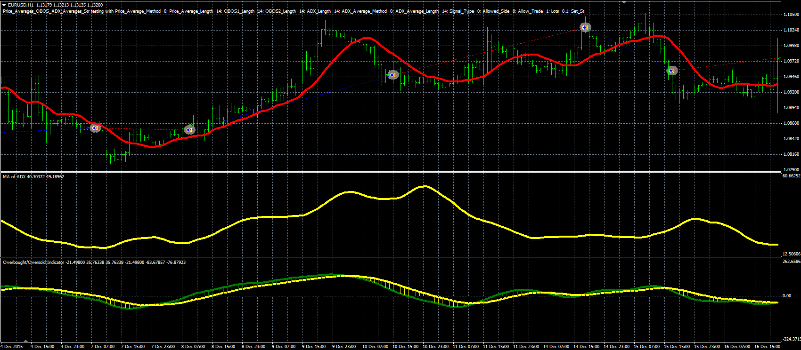

# Price averages OBOS ADX strategy

> Source: https://fxcodebase.com/code/viewtopic.php?f=38&t=63577  
> Forum: 38 · Topic 63577 · 1 post(s)

---

## Price averages OBOS ADX strategy

**Alexander.Gettinger** · Thu Jun 09, 2016 4:36 pm

The strategy uses OBOS indicator ([viewtopic.php?f=38&t=23087&p=39787](https://fxcodebase.com/code/viewtopic.php?f=38&t=23087&p=39787)) and MA of ADX oscillator ([viewtopic.php?f=38&t=63576](https://fxcodebase.com/code/viewtopic.php?f=38&t=63576)).

Buy condition: MA grows, OBOS1 and OBOS2 show BUY signals and ADX_MA grows,
Sell condition: MA falls, OBOS1 and OBOS2 show SELL signals and ADX_MA grows.

 

Download:

 [Price_Averages_OBOS_ADX_Averages_Str.mq4](files/106695/Price_Averages_OBOS_ADX_Averages_Str.mq4)

The OBOS indicator ([viewtopic.php?f=38&t=23087&p=39787](https://fxcodebase.com/code/viewtopic.php?f=38&t=23087&p=39787)) and MA of ADX oscillator ([viewtopic.php?f=38&t=63576](https://fxcodebase.com/code/viewtopic.php?f=38&t=63576)) should be installed for correct work.
