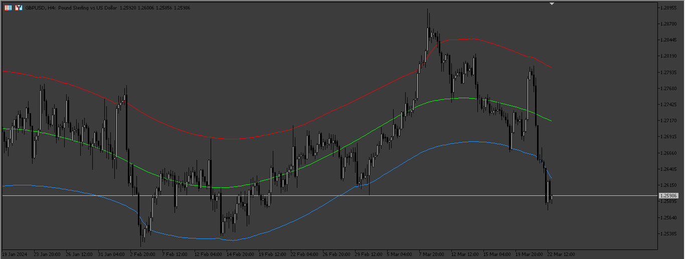

# Price_Border_MT5

> Source: https://fxcodebase.com/code/viewtopic.php?f=38&t=74733  
> Forum: 38 · Topic 74733 · 7 post(s)

---

## Price_Border_MT5

**Apprentice** · Mon Mar 25, 2024 6:06 pm

Based on the request.
[https://fxcodebase.com/code/viewtopic.php?f=27&p=154727](https://fxcodebase.com/code/viewtopic.php?f=27&p=154727)

 [Price_Border_MT5.mq5](files/154826/Price_Border_MT5.mq5)

---

## Re: Price_Border_MT5

**logicgate** · Mon Mar 25, 2024 8:03 pm

Brilliant! Thanks a lot buddy.

However, the indicator is missing the timeframe input / selector.

Can you please add it?

Best regards

---

## Re: Price_Border_MT5

**Apprentice** · Wed Mar 27, 2024 10:07 am

We have added your request to the development list.
Development reference 262

---

## Re: Price_Border_MT5

**logicgate** · Fri Aug 09, 2024 5:44 am

Hello there dear friend Apprentice.

I was doing historical analysis on this and it was looking great until I decided to replay the indicator using the strategy tester. Unfortunately the performance is completely different than on the live chart. Check the screenshots for comparison.

Do you know why this is happening, and there is a way to fix it? Can you make the indicator behave exactly the same in strategy tester and live chart?

Otherwise it's impossible to study this indicator.

Best regards

---

## Re: Price_Border_MT5

**Apprentice** · Sat Aug 10, 2024 6:58 pm

We have added your request to the development list.
Development reference 641

---

## Re: Price_Border_MT5

**logicgate** · Mon Aug 12, 2024 6:12 am

Thanks buddy, the problem is that it repaints

---

## Re: Price_Border_MT5

**Apprentice** · Fri Jul 25, 2025 4:04 am

MTF version.

 [Price_Border_MT5_MTF.mq5](files/160018/Price_Border_MT5_MTF.mq5)
