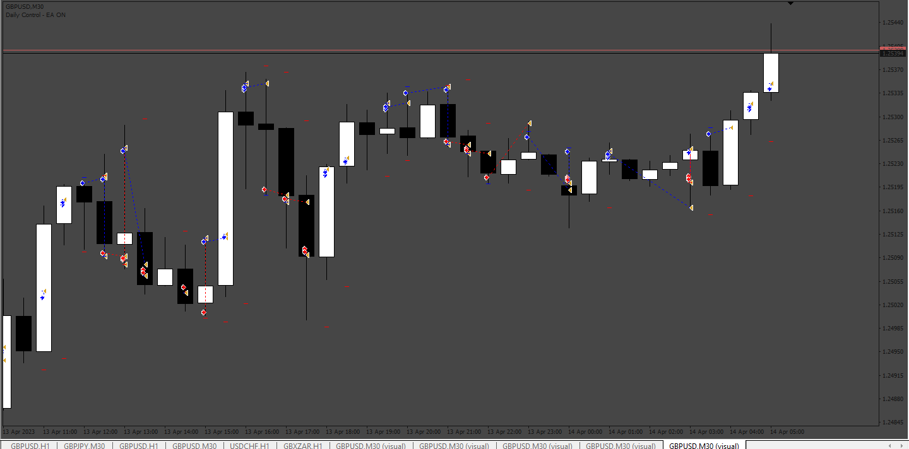

# Price_Break_EA_MT4

> Source: https://fxcodebase.com/code/viewtopic.php?f=38&t=74021  
> Forum: 38 · Topic 74021 · 14 post(s)

---

## Price_Break_EA_MT4

**Apprentice** · Thu Aug 10, 2023 12:17 pm

Based on the request.
[https://fxcodebase.com/code/viewtopic.php?f=27&p=151939](https://fxcodebase.com/code/viewtopic.php?f=27&p=151939)

 [Price_Break_EA_MT4.mq4](files/152003/Price_Break_EA_MT4.mq4)

---

## Re: Price_Break_EA_MT4

**jaymills** · Tue Aug 22, 2023 1:50 pm

> **Apprentice wrote:**
>
>
> The attachment **682.png** is no longer available
>
>
> Based on the request.
> [https://fxcodebase.com/code/viewtopic.php?f=27&p=151939](https://fxcodebase.com/code/viewtopic.php?f=27&p=151939)
>
>
> The attachment **682.png** is no longer available

Thank you so much for creating the EA.

I am having trouble getting it going. It appears to open the trades fine but it is not closing them, maybe a setting issue. It should be closing either when it hits the stop loss or when the candle closes, which ever comes first. I have attached my take profit setting but cannot make sense of it.

Could you also let me know what the following mean:
In the inputs setting: VALUE, START, STEP, STOP?
Trade Reverse?
Magic Numbers?

Thank you.

---

## Re: Price_Break_EA_MT4

**Apprentice** · Wed Aug 23, 2023 3:06 am

We have added your request to the development list.
Development reference 747.

---

## Re: Price_Break_EA_MT4

**Apprentice** · Fri Sep 01, 2023 2:55 pm

Try it now.

---

## Re: Price_Break_EA_MT4

**jaymills** · Wed Sep 06, 2023 5:10 pm

> **Apprentice wrote:**
> Try it now.

Is it the same link as above? If so I've tried it but its still not closing trades, maybe I have wrong settings that you can explain from my previous messgage?

See attachement below which shows some issues:

Candle 1 - Is opening a sell when it hits the low of the previous candle however is also openings a buy for the same candle when it hits the high of the previous candle. Which ever opens first it should cancel the other one out. I would only like this to be an option whether I want both side of trades to open, but generally one should cancel out the other.

Candle 2 - Its opened a buy position when it hits the high of the previous candle and has set a stop loss as a low of the previous candle which is perfect. But it just hasn't closed the trade when the current candle closes, it ends up closing after 2/3 pips for some reason. As stated previous there should be two options here either it should close as soon as the candle closes or close by a fixed pip amount, I've tried to change the pip amount in settings but its not working.

Candle 3 - Similar to candle 2, it opened a buy when price hit previous candles high however went into loss but it did not close the trade at the close of the candle even if it is in loss, it was set to close at the stop loss which is the low of the previous candle. This should as soon as the candle closes or SL whichever comes first.

Thank You once again.

---

## Re: Price_Break_EA_MT4

**Apprentice** · Sun Sep 10, 2023 2:50 pm

We have added your request to the development list.
Development reference 825.

---

## Re: Price_Break_EA_MT4

**Apprentice** · Sat Sep 16, 2023 3:52 am

[Price_Break_EA_MT4.mq4](files/152587/Price_Break_EA_MT4.mq4)

Try his version.

---

## Re: Price_Break_EA_MT4

**fiox89** · Wed Feb 07, 2024 5:00 pm

> **Apprentice wrote:**
>
>
> Price_Break_EA_MT4.mq4
>
>
> Try his version.

Hi Apprentice, thanks for this code, it's really well written, I'm learning a lot by studying it. I'm trying to make some changes and among these I would like to be able to set the take profit to 2 or 3 times the stop lose. I'm trying to add these lines, but I'm definitely doing something wrong, my programming skills are very poor. Any advice? cheers

Code: [Select all](https://fxcodebase.com/code/)
`case TwoTimesTheStopLose:
levelTP = new Levels(new ByPipsFromCandle(_Symbol, side, 2*userSLpips, "TP", 0, 1));
result = levelTP.calculateLevel();`

---

## Re: Price_Break_EA_MT4

**Apprentice** · Tue Feb 13, 2024 7:55 am

We have added your request to the development list.
Development reference 152

---

## Re: Price_Break_EA_MT4

**Apprentice** · Tue May 14, 2024 9:30 am

[Price_Break_EA_MT4_v2.mq4](files/155340/Price_Break_EA_MT4_v2.mq4)

Try this version.

---

## Re: Price_Break_EA_MT4

**myhome13** · Tue Jun 11, 2024 9:20 am

Dear
pls add TSL in this EA.

---

## Re: Price_Break_EA_MT4

**Apprentice** · Wed Jun 12, 2024 3:06 pm

We have added your request to the development list.
Development reference 485

---

## Re: Price_Break_EA_MT4

**myhome13** · Tue Jun 25, 2024 11:11 pm

sir any Update for reference 485

---

## Re: Price_Break_EA_MT4

**Apprentice** · Sat Jul 13, 2024 1:13 am

[Price_Break_EA_MT4_v3.mq4](files/156097/Price_Break_EA_MT4_v3.mq4)

Try this version.
