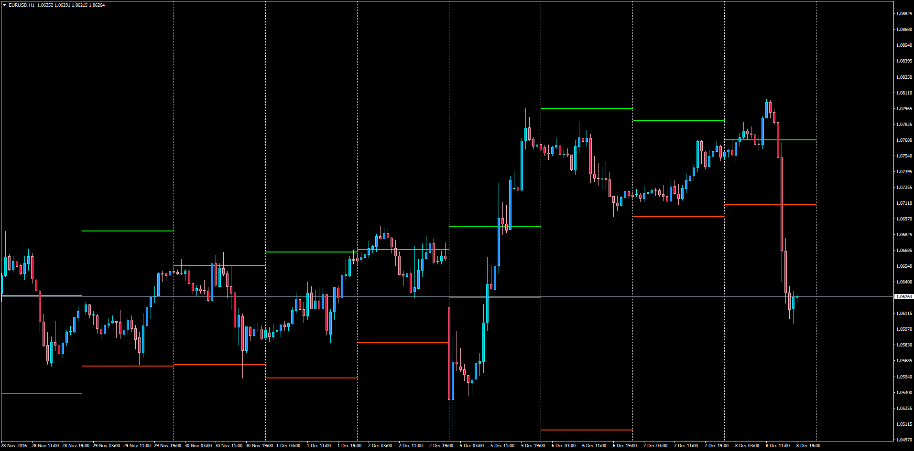
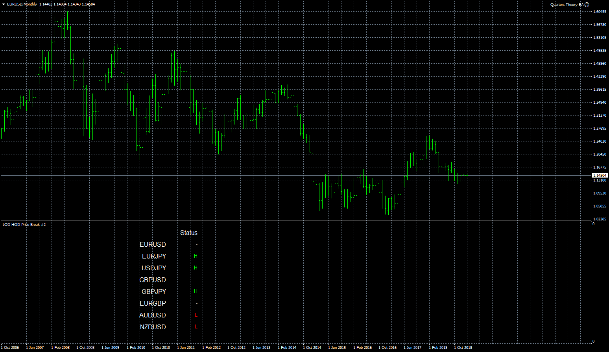

# Price break PrLOD/HOD Alert

> Source: https://fxcodebase.com/code/viewtopic.php?f=38&t=64189  
> Forum: 38 · Topic 64189 · 15 post(s)

---

## Price break PrLOD/HOD Alert

**Apprentice** · Thu Dec 08, 2016 4:18 pm

This indicator will alert the trader when price breaks either the high or low of the previous day. It will also display the high and low that price needed to break each day.

 [LOD_HOD_Price_Break.mq4](files/109636/LOD_HOD_Price_Break.mq4)

 

 [LOD_HOD_Price_Break_dashboard.mq4](files/109636/LOD_HOD_Price_Break_dashboard.mq4)

---

## Re: Price break PrLOD/HOD Alert

**fxant2a** · Mon Jan 09, 2017 7:59 am

Can you please add an Alert option so we can choose the alert we want (sound alert, email alert, mobile notification(?

Thanks
Antonis

---

## Re: Price break PrLOD/HOD Alert

**Apprentice** · Tue Jan 10, 2017 3:13 pm

Your request is added to the development list, Under Id Number 3709
 If someone is interested to do this task, please contact me.

---

## Re: Price break PrLOD/HOD Alert

**Alexander.Gettinger** · Fri Sep 22, 2017 11:47 am

> **fxant2a wrote:**
> Can you please add an Alert option so we can choose the alert we want (sound alert, email alert, mobile notification(?
>
> Thanks
> Antonis

Alert added.

---

## Re: Price break PrLOD/HOD Alert

**Alexander.Gettinger** · Fri Sep 22, 2017 11:47 am

> **fxant2a wrote:**
> Can you please add an Alert option so we can choose the alert we want (sound alert, email alert, mobile notification(?
>
> Thanks
> Antonis

Alert added.

---

## Re: Price break PrLOD/HOD Alert

**cmetrader** · Wed Jan 30, 2019 11:53 pm

Hi, would be possible to make a dashboard with alerts for this indicator?

---

## Re: Price break PrLOD/HOD Alert

**Apprentice** · Thu Jan 31, 2019 6:36 am

Your request is added to the development list, Under Id Number 4448

---

## Re: Price break PrLOD/HOD Alert

**cmetrader** · Thu Jan 31, 2019 11:57 am

Hi Apprentice,

Regarding Id Number 4448, I was hoping that it would be possible to add for the 28 pairs with the previous day's ADR and the ADR for the last 10/20 or 50 periods and the current ADR for each pair(plus arrow direction of trend)...that way you could see which pair is in a tight range and ready for a breakout. Thank you in advance!

Kind regards,

Tim

---

## Re: Price break PrLOD/HOD Alert

**Apprentice** · Mon Feb 04, 2019 9:11 am

Something like LOD_HOD_Price_Break_dashboard.mq4?

---

## Re: Price break PrLOD/HOD Alert

**cmetrader** · Mon Feb 04, 2019 5:43 pm

That is good, but it would be nice to see the ADR for the previous day, and the current day ADR and the ADR for the previous 10/20 or 50 ADR (a user's setting preference)

Regards,

Tim

---

## Re: Price break PrLOD/HOD Alert

**cmetrader** · Mon Feb 04, 2019 6:03 pm

Hi Apprentice,

I like to know if you can have the alerts respond on the bar close. Thanks in advance.

Kind regards,

Tim

---

## Re: Price break PrLOD/HOD Alert

**Apprentice** · Tue Feb 05, 2019 10:42 am

Your request is added to the development list under Id Number 4456

---

## Re: Price break PrLOD/HOD Alert

**cmetrader** · Tue Feb 05, 2019 1:30 pm

Hi Apprentice,

I like to know if you can make the alert for each individual currency as it makes a new high or low on the bar close, instead of only alerting for the current chart pair...thanks in advance.

Kind regards.

Tim

---

## Re: Price break PrLOD/HOD Alert

**Apprentice** · Thu Feb 07, 2019 5:19 pm

[LOD_HOD_Price_Break_dashboard.mq4](files/123755/LOD_HOD_Price_Break_dashboard.mq4)

Try this version. (Task 4456)

---

## Re: Price break PrLOD/HOD Alert

**cmetrader** · Thu Feb 07, 2019 11:38 pm

This version appears to be just like the 1st version.
