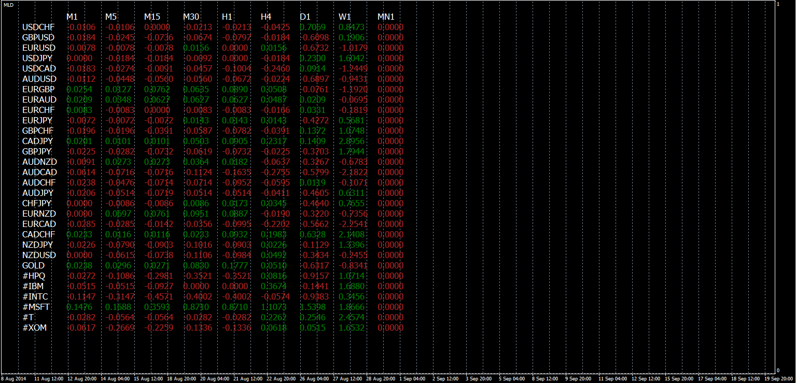

# PRICE CHANGE

> Source: https://fxcodebase.com/code/viewtopic.php?f=38&t=61197  
> Forum: 38 · Topic 61197 · 1 post(s)

---

## PRICE CHANGE

**Apprentice** · Sun Sep 21, 2014 6:32 am

Based on request.
[viewtopic.php?f=27&t=60995&p=96041#p96041](https://fxcodebase.com/code/viewtopic.php?f=27&t=60995&p=96041#p96041)
Will show the percentage or pip change for all Instrument on all time frames.

 [Price Change.mq4](files/96040/Price%20Change.mq4)
