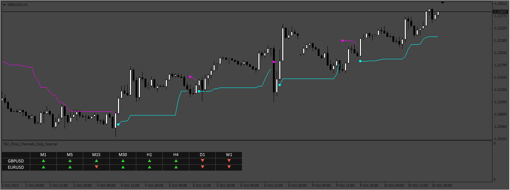
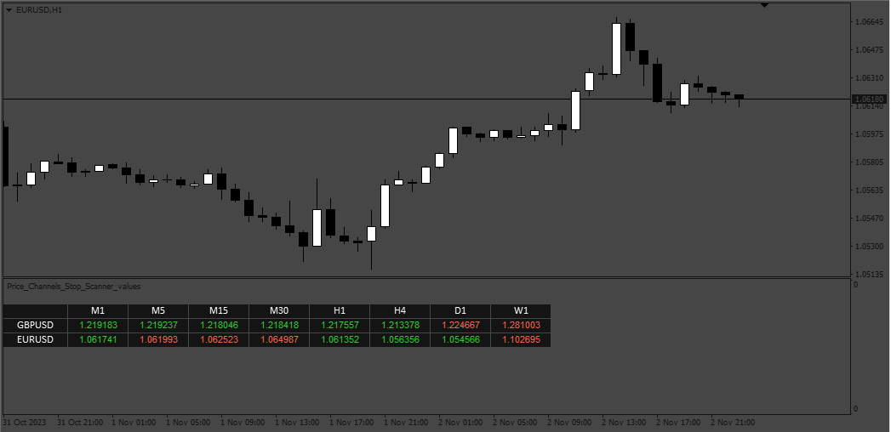

# Price_Channels_Stop_Scanner

> Source: https://fxcodebase.com/code/viewtopic.php?f=38&t=74243  
> Forum: 38 · Topic 74243 · 4 post(s)

---

## Price_Channels_Stop_Scanner

**Apprentice** · Fri Oct 13, 2023 2:59 am

Based on the request.
[https://fxcodebase.com/code/viewtopic.php?f=27&t=74222](https://fxcodebase.com/code/viewtopic.php?f=27&t=74222)

 [pricechannel_stop_v1.3.mq4](files/152908/pricechannel_stop_v1.3.mq4)

 [Price_Channels_Stop_Scanner.mq4](files/152908/Price_Channels_Stop_Scanner.mq4)

---

## Re: Price_Channels_Stop_Scanner

**Teja_Siddani** · Sat Oct 14, 2023 12:19 am

Thank you,

Is it possible to include indicator cal in the code, I mean not using custom indicator directly cal in the code. And I want Channel Value in the table

---

## Re: Price_Channels_Stop_Scanner

**Apprentice** · Tue Oct 17, 2023 10:34 am

We have added your request to the development list.
Development reference 933

---

## Re: Price_Channels_Stop_Scanner

**Apprentice** · Fri Nov 10, 2023 2:42 pm

 [Price_Channels_Stop_Scanner_values.mq4](files/153235/Price_Channels_Stop_Scanner_values.mq4)
