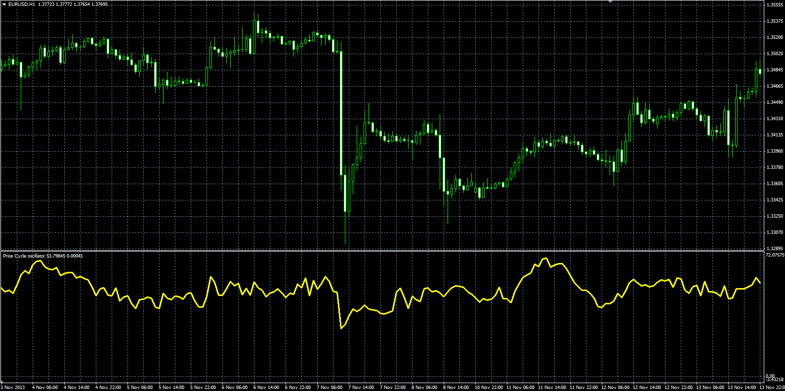

# Price Cycle oscillator

> Source: https://fxcodebase.com/code/viewtopic.php?f=38&t=60405  
> Forum: 38 · Topic 60405 · 1 post(s)

---

## Price Cycle oscillator

**Alexander.Gettinger** · Wed Mar 05, 2014 5:06 pm

Original LUA oscillator: [viewtopic.php?f=17&t=60203](https://fxcodebase.com/code/viewtopic.php?f=17&t=60203).

Formula:
Price Cycle = 100*MA(Close-Low, Length, Method)/ATR(Length).

 

Download:

 [PC.mq4](files/93043/PC.mq4)
