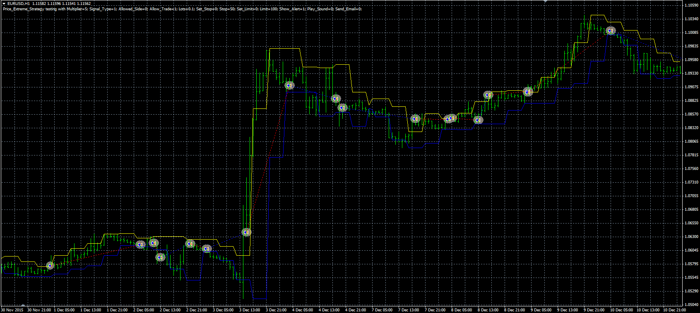

# Price extreme strategy

> Source: https://fxcodebase.com/code/viewtopic.php?f=38&t=63580  
> Forum: 38 · Topic 63580 · 1 post(s)

---

## Price extreme strategy

**Alexander.Gettinger** · Thu Jun 09, 2016 4:49 pm

The strategy based on the Price extreme indicator ([viewtopic.php?f=38&t=18854&p=33676](https://fxcodebase.com/code/viewtopic.php?f=38&t=18854&p=33676)).

Buy condition: High price crosses above the upper band.
Sell condition: Low price crosses under the lower band.

 

Download:

 [Price_Extreme_Strategy.mq4](files/106698/Price_Extreme_Strategy.mq4)
