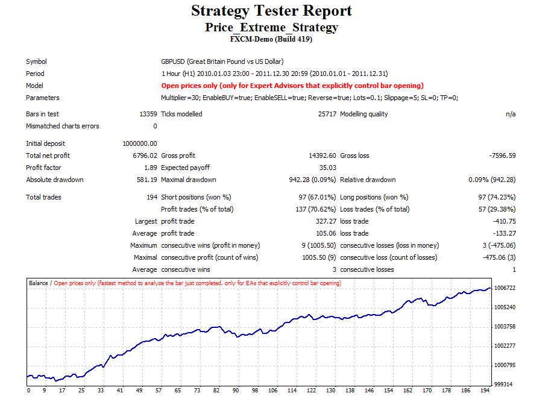

# Price extreme strategy

> Source: https://fxcodebase.com/code/viewtopic.php?f=38&t=19028  
> Forum: 38 · Topic 19028 · 1 post(s)

---

## Price extreme strategy

**Alexander.Gettinger** · Wed May 23, 2012 10:53 am

This strategy uses the Price extreme indicator ([viewtopic.php?f=38&t=18854](https://fxcodebase.com/code/viewtopic.php?f=38&t=18854)).
Orders open/close at the intersection of close price and border of indicator.

 

Download:

 [Price_Extreme_Strategy.mq4](files/33905/Price_Extreme_Strategy.mq4)

For strategy must be installed Price extreme indicator ([viewtopic.php?f=38&t=18854](https://fxcodebase.com/code/viewtopic.php?f=38&t=18854)).
