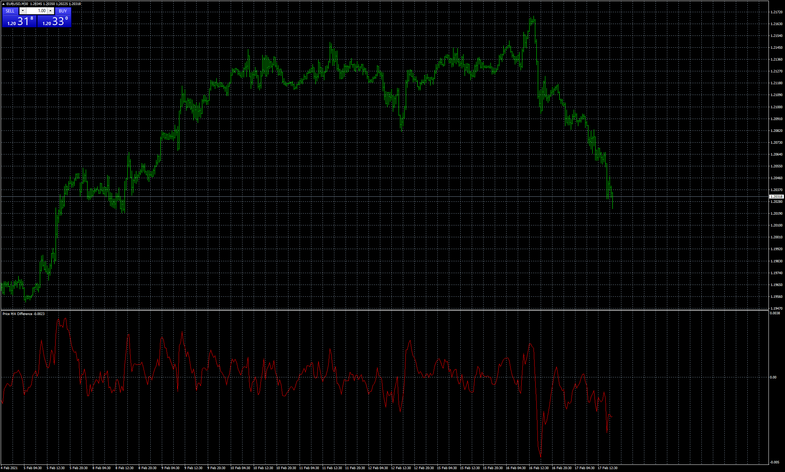

# Price MA Diffrence

> Source: https://fxcodebase.com/code/viewtopic.php?f=38&t=70937  
> Forum: 38 · Topic 70937 · 4 post(s)

---

## Price MA Diffrence

**Apprentice** · Wed Feb 17, 2021 10:53 am

TS2/Lua version.
[viewtopic.php?f=17&t=70916](https://fxcodebase.com/code/viewtopic.php?f=17&t=70916)

 [Price MA Diffrence.mq4](files/140799/Price%20MA%20Diffrence.mq4)

 [MA MA Diffrence.mq4](files/140799/MA%20MA%20Diffrence.mq4)

---

## Re: Price MA Diffrence

**swnlobo** · Thu Feb 18, 2021 8:57 am

Wonderful. I will try it

Many Thanks

All the best
Swnlobo

---

## Re: Price MA Diffrence

**swnlobo** · Thu Feb 18, 2021 2:18 pm

I tried it but it doesn't allow calculation for zerolagEMA on MA difference.

Could you add it to the mq4 indicator?

Thanks

---

## Re: Price MA Diffrence

**Apprentice** · Fri Feb 19, 2021 1:28 pm

This is an MT4 restriction.
We will need to hardcode it.
