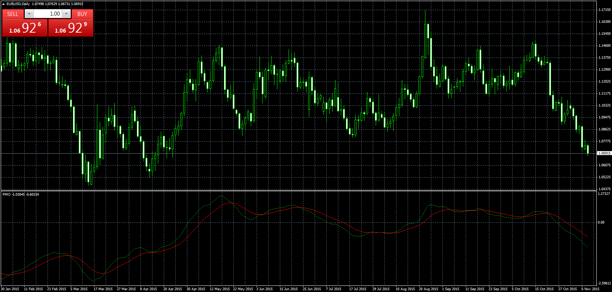
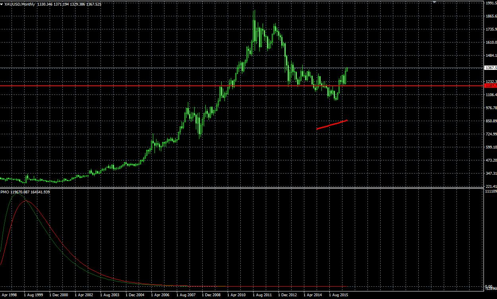

# Price_Momentum_Oscillator

> Source: https://fxcodebase.com/code/viewtopic.php?f=38&t=62869  
> Forum: 38 · Topic 62869 · 3 post(s)

---

## Price_Momentum_Oscillator

**Apprentice** · Tue Nov 10, 2015 1:08 pm

Price Momentum Oscillator (PMO) is an oscillator based on a Rate of Change (ROC) calculation that is smoothed twice with exponential moving averages that use a custom smoothing process. Because the PMO is normalized, it can also be used as a relative strength tool.

 [Price_Momentum_Oscillator.mq4](files/103294/Price_Momentum_Oscillator.mq4)

---

## Re: Price_Momentum_Oscillator

**ciclone** · Tue Nov 10, 2015 4:24 pm

thanks to the development of the indicator that I had asked. You are a forum of great people. Again many thanks

---

## Re: Price_Momentum_Oscillator

**topeak** · Tue Jul 05, 2016 10:38 pm

> **Apprentice wrote:**
>
>
> The attachment **eurusd-d1-forex-capital-markets-2.png** is no longer available
>
>
> Price Momentum Oscillator (PMO) is an oscillator based on a Rate of Change (ROC) calculation that is smoothed twice with exponential moving averages that use a custom smoothing process. Because the PMO is normalized, it can also be used as a relative strength tool.
>
>
> The attachment **eurusd-d1-forex-capital-markets-2.png** is no longer available

Thanks to the development of the indicator,
but montyly chart seems to be incorrect

 

