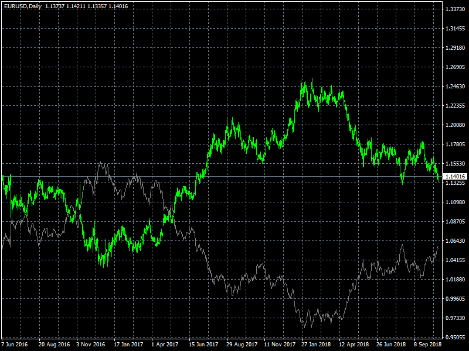

# Price Overlay

> Source: https://fxcodebase.com/code/viewtopic.php?f=38&t=68378  
> Forum: 38 · Topic 68378 · 3 post(s)

---

## Price Overlay

**Apprentice** · Tue Apr 23, 2019 6:58 am

Based on TS2/Lua
[viewtopic.php?f=17&t=2324](https://fxcodebase.com/code/viewtopic.php?f=17&t=2324)

 [Price Overlay.mq4](files/125911/Price%20Overlay.mq4)

---

## Re: Price Overlay

**jusiur** · Tue Apr 23, 2019 4:26 pm

Thank you very much for such a precise tool. I have a question regarding the scale (normalize mode), is it different to incorporate 28 times in the main graph to each one of the pairs that if a single indicator were coded that has all of them incorporated at the same time? Would it improve the scale (normalization) or would it be the same?

---

## Re: Price Overlay

**Apprentice** · Wed Apr 24, 2019 3:33 pm

It will be the same.
