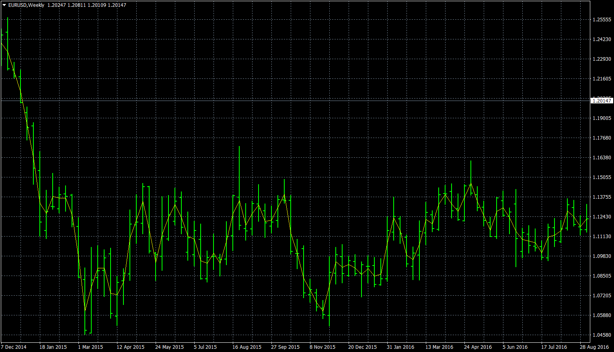

# Price Pivot

> Source: https://fxcodebase.com/code/viewtopic.php?f=38&t=65505  
> Forum: 38 · Topic 65505 · 1 post(s)

---

## Price Pivot

**Apprentice** · Wed Jan 03, 2018 8:35 am

Based on the request.
[viewtopic.php?f=27&t=65480](https://fxcodebase.com/code/viewtopic.php?f=27&t=65480)

median is (high+low)/2
typical is (high+low+close)/3
weighted is (high+low+2*close)/4
Ask if you need additional price types.

 [Price Pivot.mq4](files/116738/Price%20Pivot.mq4)
