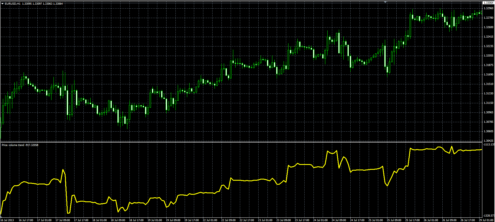

# Price Volume Trend oscillator

> Source: https://fxcodebase.com/code/viewtopic.php?f=38&t=59086  
> Forum: 38 · Topic 59086 · 5 post(s)

---

## Price Volume Trend oscillator

**Alexander.Gettinger** · Tue Aug 13, 2013 2:12 pm

Original LUA oscillator: [viewtopic.php?f=17&t=23071](https://fxcodebase.com/code/viewtopic.php?f=17&t=23071).

> Calculation
> PVT = ((Close-Close(-1))/Close(-1))* Volume + PVT(-1)

 

Download:

 [PVT.mq4](files/88514/PVT.mq4)

---

## Re: Price Volume Trend oscillator

**durlovjagiroad** · Sun Oct 20, 2019 5:43 am

Will you add custom currency pair option in the indicator. For example-NIFTY,EURUSD etc.. anything that i want.

---

## Re: Price Volume Trend oscillator

**Apprentice** · Mon Oct 21, 2019 5:00 am

Your request is added to the development list.
Development reference 224.

---

## Re: Price Volume Trend oscillator

**Apprentice** · Tue Oct 22, 2019 4:27 am

[Custom Currency Pair PVT.mq4](files/129365/Custom%20Currency%20Pair%20PVT.mq4)

Try this version.

---

## Re: Price Volume Trend oscillator

**durlovjagiroad** · Tue Oct 22, 2019 5:44 am

It does not take currencypair from the watchlist
