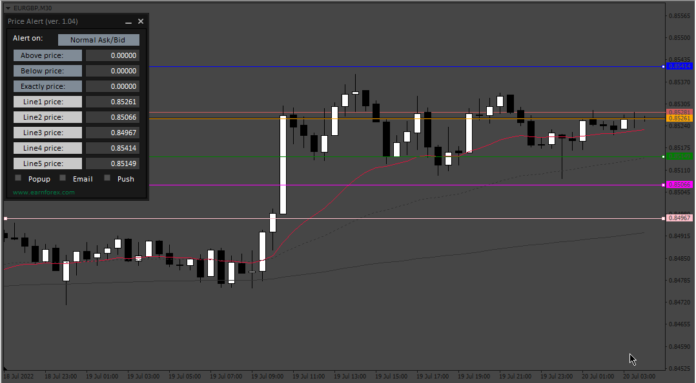

# PriceAlert_Panel

> Source: https://fxcodebase.com/code/viewtopic.php?f=38&t=72538  
> Forum: 38 · Topic 72538 · 3 post(s)

---

## PriceAlert_Panel

**Apprentice** · Thu Jul 21, 2022 1:48 am

Based on the request.
[https://fxcodebase.com/code/viewtopic.php?f=38&t=72473](https://fxcodebase.com/code/viewtopic.php?f=38&t=72473)

 [PriceAlert_Panel.mq4](files/146833/PriceAlert_Panel.mq4)

---

## Re: PriceAlert_Panel

**Honest_Trader** · Thu Jul 21, 2022 9:46 pm

Thank you dearly Apprentice. You are the man with the magic wand, you make it happen anything that we ask for.

I know with so many requests from my end, you have been tirelessly honoring them without delay, and I am due to return my side of the bargain, which I am sure will in due course with all of your help.

God bless you my friend.

Cheers
GK

---

## Re: PriceAlert_Panel about the theme

**newproplus** · Sun Nov 06, 2022 6:46 pm

Hi Apprentice,I tried this code,but the theme is different from your image,is there any way to set it to dark mode?
Thank you.
