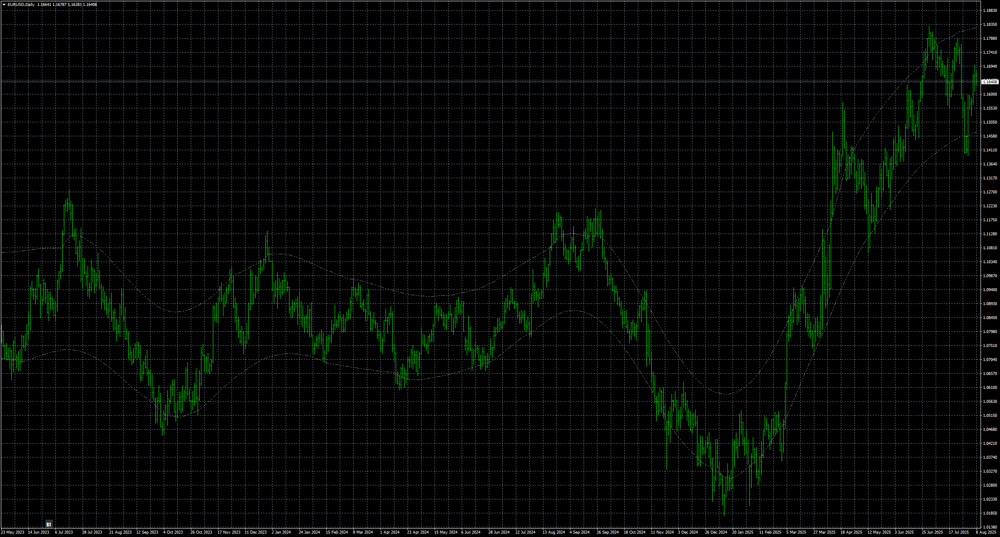

# PRICEBAND_MTF_BTN_-_Current_TF

> Source: https://fxcodebase.com/code/viewtopic.php?f=38&t=76225  
> Forum: 38 · Topic 76225 · 4 post(s)

---

## PRICEBAND_MTF_BTN_-_Current_TF

**Apprentice** · Sun Aug 10, 2025 4:18 am

Based on the request.
[https://fxcodebase.com/code/viewtopic.p ... 56#p149756](https://fxcodebase.com/code/viewtopic.php?f=27&p=149756#p149756)

 [PRICEBAND_MTF_BTN_-_Current_TF.mq4](files/160177/PRICEBAND_MTF_BTN_-_Current_TF.mq4)

---

## Re: PRICEBAND_MTF_BTN_-_Current_TF

**khanatd** · Tue Oct 21, 2025 12:33 am

hi sir plz add mt4 non repaint arrows at close of current candle or reversals/continuations /breakouts etc

thanks
khan

---

## Re: PRICEBAND_MTF_BTN_-_Current_TF

**Apprentice** · Tue Oct 21, 2025 9:38 am

We have added your request to the development list.
Development reference 679

---

## Re: PRICEBAND_MTF_BTN_-_Current_TF

**Apprentice** · Wed Oct 29, 2025 4:14 pm

[PRICEBAND_MTF_BTN_-_Current_TF_arrow.mq4](files/161098/PRICEBAND_MTF_BTN_-_Current_TF_arrow.mq4)
