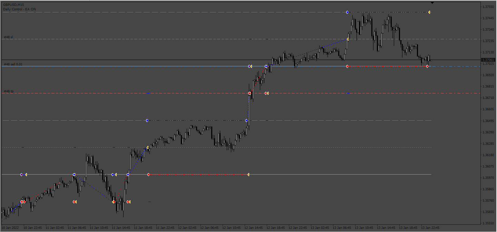
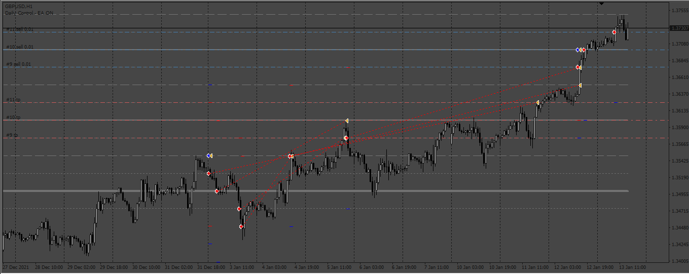
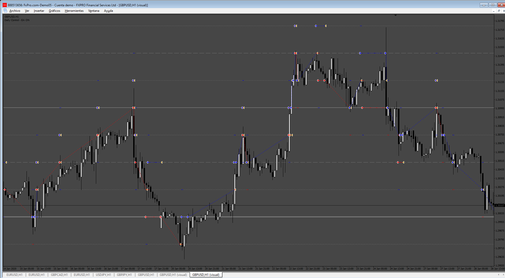

# PriceLineGrid_EA

> Source: https://fxcodebase.com/code/viewtopic.php?f=38&t=74368  
> Forum: 38 · Topic 74368 · 14 post(s)

---

## PriceLineGrid_EA

**Apprentice** · Fri Nov 24, 2023 4:03 am

Based on the request.
[https://fxcodebase.com/code/viewtopic.php?f=17&t=74316](https://fxcodebase.com/code/viewtopic.php?f=17&t=74316)

 [!AFP_PriceLineGrid.mq4](files/153402/AFP_PriceLineGrid.mq4)

 [PriceLineGrid_EA.mq4](files/153402/PriceLineGrid_EA.mq4)

---

## Re: PriceLineGrid_EA

**melinas** · Fri Dec 01, 2023 9:20 am

Is it possible to make a MT5 EA out of this one? Thanks in advance

---

## Re: PriceLineGrid_EA

**Apprentice** · Tue Dec 05, 2023 7:12 am

We have added your request to the development list.
Development reference 1073

---

## Re: PriceLineGrid_EA

**Apprentice** · Thu Dec 28, 2023 5:11 am

 [PriceLineGrid_EA_v2.mq4](files/153822/PriceLineGrid_EA_v2.mq4)

 [PriceLineGrid_EA_v3.mq4](files/153822/PriceLineGrid_EA_v3.mq4)

---

## Re: PriceLineGrid_EA

**Apprentice** · Tue Jun 25, 2024 11:57 am

 [!AFP_PriceLineGrid.mq5](files/155903/AFP_PriceLineGrid.mq5)

---

## Re: PriceLineGrid_EA

**xmohammad** · Mon Jul 08, 2024 2:13 am

> **Apprentice wrote:**
>
>
> The attachment **1129.png** is no longer available
>
>
>
>
> The attachment **1129.png** is no longer available
>
>
>
>
> The attachment **1129.png** is no longer available

According to the picture, after a few rounds of working, the linear indicators stopped and the robot stopped working
I have a fix request Price line grid_ea v3

---

## Re: PriceLineGrid_EA

**Apprentice** · Sat Jul 13, 2024 2:13 am

We have added your request to the development list.
Development reference 574

---

## Re: PriceLineGrid_EA

**Apprentice** · Tue Sep 10, 2024 11:57 am

 [PriceLineGrid_EA_v3.mq4](files/156650/PriceLineGrid_EA_v3.mq4)

---

## Re: PriceLineGrid_EA

**nablito** · Fri Oct 11, 2024 5:54 am

In the latest version many OrderSend error 4107:

PriceLineGrid_EA_v3 EURUSD,M5: SendNewOrder::doAction Connot Send Order, error: 4107
PriceLineGrid_EA_v3 EURUSD,M5: invalid takeprofit for OrderSend function

Can you add a Reverse Order? For example, instead of a sell stop we will have a buy limit, and instead of a buy stop a sell limit, etc.

Thanks

---

## Re: PriceLineGrid_EA

**Apprentice** · Thu Oct 17, 2024 5:23 pm

We have added your request to the development list.
Development reference 799

---

## Re: PriceLineGrid_EA

**Apprentice** · Mon Nov 04, 2024 5:09 am

[PriceLineGrid_EA_v4.mq4](files/157174/PriceLineGrid_EA_v4.mq4)

I can't add reverse mode.

---

## Re: PriceLineGrid_EA

**xmohammad** · Wed Nov 27, 2024 8:27 am

> **Apprentice wrote:**
>
>
> 574.png
>
>
>
>
> PriceLineGrid_EA_v3.mq4

Please add level 2 functionality+. Enable /disabled
Call the current trading method of the robot level 1
Level 2 means that the level 1 position will be repeated once again at the stop loss point when it loses.

---

## Re: PriceLineGrid_EA

**Apprentice** · Wed Nov 27, 2024 2:40 pm

We have added your request to the development list.
Development reference 875

---

## Re: PriceLineGrid_EA

**Apprentice** · Sun Dec 01, 2024 5:18 am

[PriceLineGrid_EA_v5.mq4](files/157401/PriceLineGrid_EA_v5.mq4)

Try this version.
