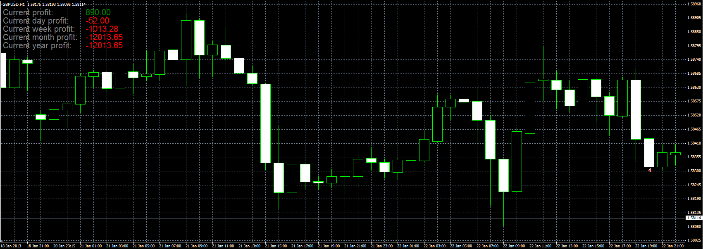

# Profit calculator

> Source: https://fxcodebase.com/code/viewtopic.php?f=38&t=31491  
> Forum: 38 · Topic 31491 · 4 post(s)

---

## Profit calculator

**Alexander.Gettinger** · Mon Jan 28, 2013 5:00 pm

The indicator calculates profit:
- current
- for the current day
- for the current week
- for the current month
- for the current year

 

Download:

 [ProfitCalculator.mq4](files/53722/ProfitCalculator.mq4)

 [ProfitCalculator.mq5](files/53722/ProfitCalculator.mq5)

---

## Re: Profit calculator

**yolerap** · Wed Feb 17, 2021 12:09 pm

PLease translate to MT5 and add the "pip profit" too, thank you

---

## Re: Profit calculator

**Apprentice** · Thu Feb 18, 2021 7:04 am

Your request is added to the development list.
Development reference 212.

---

## Re: Profit calculator

**Apprentice** · Sat Feb 20, 2021 2:58 pm

ProfitCalculator.mq5 added.
