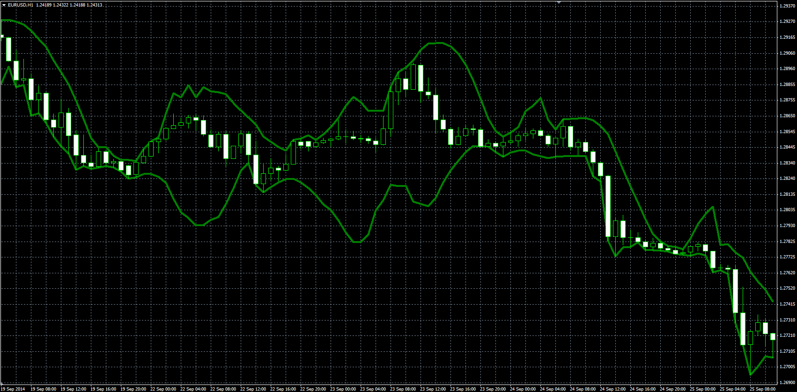
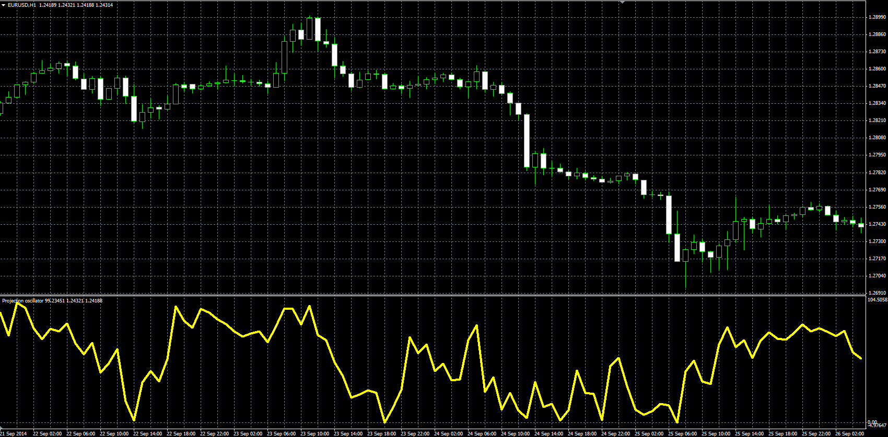

# Projection bands and oscillator

> Source: https://fxcodebase.com/code/viewtopic.php?f=38&t=61539  
> Forum: 38 · Topic 61539 · 1 post(s)

---

## Projection bands and oscillator

**Alexander.Gettinger** · Tue Nov 25, 2014 11:28 am

**1. Projection band**

Formulas:
UpBand[i] = Max(High[i], High[i-1]+i*SlopeHigh,
DnBand[i] = Min(Low[i], Low[i-1]-i*SlopeLow), where
SlopeHigh - slope of linear regression line for High prices,
SlopeLow - slope of linear regression line for Low prices.

 

Download:

 [Projection_Bands.mq4](files/97369/Projection_Bands.mq4)

**2. Projection oscillator**

Formulas:
PO = 100*(Close-DnBand)/(UpBand-DnBand), where
UpBand[i] = Max(High[i], High[i-1]+i*SlopeHigh,
DnBand[i] = Min(Low[i], Low[i-1]-i*SlopeLow),
SlopeHigh - slope of linear regression line for High prices,
SlopeLow - slope of linear regression line for Low prices.

 

Download:

 [Projection_Oscillator.mq4](files/97369/Projection_Oscillator.mq4)
