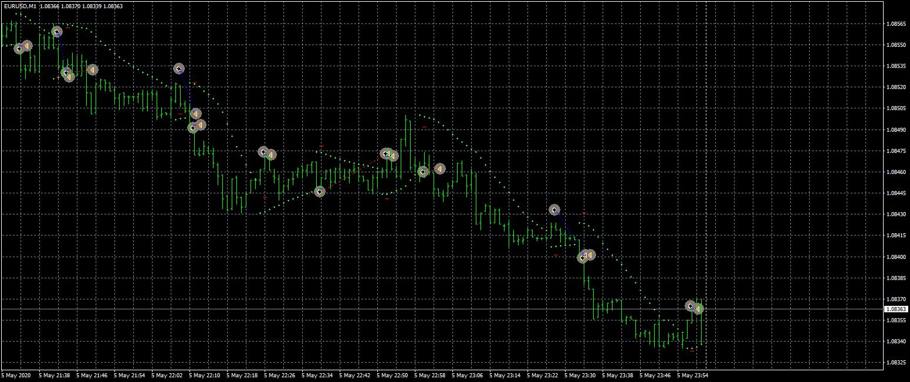

# PSAR_Expert

> Source: https://fxcodebase.com/code/viewtopic.php?f=38&t=70417  
> Forum: 38 · Topic 70417 · 5 post(s)

---

## PSAR_Expert

**Apprentice** · Thu Sep 10, 2020 2:11 am

Based on request.
[viewtopic.php?f=27&t=70405](https://fxcodebase.com/code/viewtopic.php?f=27&t=70405)

 [PSAR_Expert.mq4](files/137506/PSAR_Expert.mq4)

---

## Re: PSAR_Expert

**Apprentice** · Mon Oct 12, 2020 2:47 am

[PSAR_Expert with MA Filter.mq4](files/138217/PSAR_Expert%20with%20MA%20Filter.mq4)

Version with MA filter.

---

## Re: PSAR_Expert

**chakisii** · Thu Oct 15, 2020 5:49 am

Thanks so very much apprentice for the effort and good work.However, the EA is not opening trades at all. I wish you could work on it.

---

## Re: PSAR_Expert

**Apprentice** · Fri Oct 16, 2020 7:32 am

Your request is added to the development list.
Development reference 2197.

---

## Re: PSAR_Expert

**Apprentice** · Mon Oct 19, 2020 5:41 am

[PSAR_Expert.mq4](files/138335/PSAR_Expert.mq4)

Please check the expert properties for the mistakes.
