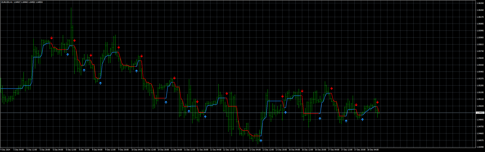
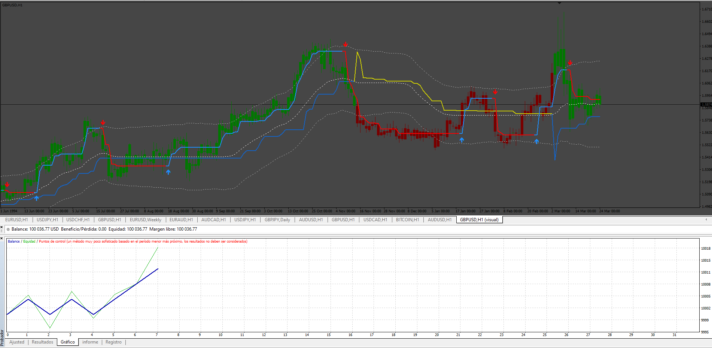

# Psar Nostradamix_EA_v1.00

> Source: https://fxcodebase.com/code/viewtopic.php?f=38&t=75430  
> Forum: 38 · Topic 75430 · 4 post(s)

---

## Psar Nostradamix_EA_v1.00

**Apprentice** · Wed Dec 18, 2024 3:46 am

 [Nostradamix.ex4](files/157564/Nostradamix.ex4)

Based on the request.
[https://fxcodebase.com/code/viewtopic.p ... 21#p157521](https://fxcodebase.com/code/viewtopic.php?f=39&p=157521#p157521)

 [Psar Nostradamix_EA_v1.00.mq4](files/157564/Psar%20Nostradamix_EA_v1.00.mq4)

---

## Re: Psar Nostradamix_EA_v1.00

**trtrader** · Wed Dec 25, 2024 9:33 am

Could you please add the attached indicator as filter? Also please add this filter indicator's settings to EAs input menu.

Thanks

---

## Re: Psar Nostradamix_EA_v1.00

**Apprentice** · Mon Dec 30, 2024 7:51 pm

We have added your request to the development list.
Development reference 935

---

## Re: Psar Nostradamix_EA_v1.00

**Apprentice** · Mon Jan 20, 2025 3:58 pm

 [super trend (profit max)1.1.ex4](files/157918/super%20trend%20%28profit%20max%291.1.ex4)

 [Psar_Nostradamix_EA_v2.00.ex4](files/157918/Psar_Nostradamix_EA_v2.00.ex4)
