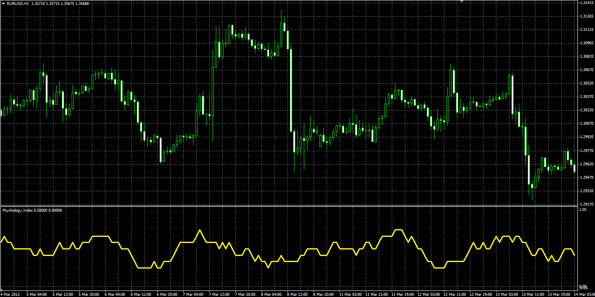

# Psychology Index

> Source: https://fxcodebase.com/code/viewtopic.php?f=38&t=60023  
> Forum: 38 · Topic 60023 · 1 post(s)

---

## Psychology Index

**Alexander.Gettinger** · Fri Nov 29, 2013 2:20 pm

Original LUA indicator: [viewtopic.php?f=17&t=59730&p=90314](https://fxcodebase.com/code/viewtopic.php?f=17&t=59730&p=90314).

Formulas:
Psychology Index[i] = MVA(UpDay), where
UpDay[i] = 1, if Close[i]>Close[i-1],
UpDay[i] = 0, in other cases.

 

Download:

 [Psychology_Index.mq4](files/91238/Psychology_Index.mq4)
