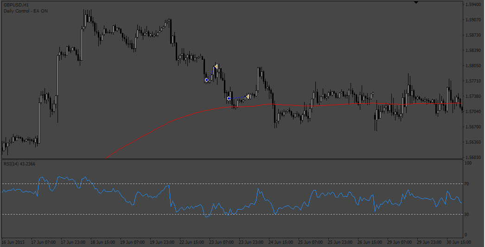

# Pull_Back_ea

> Source: https://fxcodebase.com/code/viewtopic.php?f=38&t=73794  
> Forum: 38 · Topic 73794 · 5 post(s)

---

## Pull_Back_ea

**Apprentice** · Sun Jun 04, 2023 3:04 am

Based on the request.
[https://fxcodebase.com/code/viewtopic.php?f=27&p=151009](https://fxcodebase.com/code/viewtopic.php?f=27&p=151009)

 [Pull_Back_ea.mq4](files/151108/Pull_Back_ea.mq4)

---

## Re: Pull_Back_ea

**crypto0014** · Mon Jun 05, 2023 6:09 pm

Lot size unable to change.. backtesting also not working properly

---

## Re: Pull_Back_ea

**crypto0014** · Thu Jun 08, 2023 10:19 pm

Something need fixing.EA only takes 3-4 trades max in year of backtesting.

---

## Re: Pull_Back_ea

**Apprentice** · Thu Jun 15, 2023 5:06 am

We have added your request to the development list.
Development reference 516.

---

## Re: Pull_Back_ea

**Apprentice** · Tue Jun 20, 2023 1:14 pm

[Pull_Back_EA_v1.10.mq4](files/151322/Pull_Back_EA_v1.10.mq4)

Try this version.
