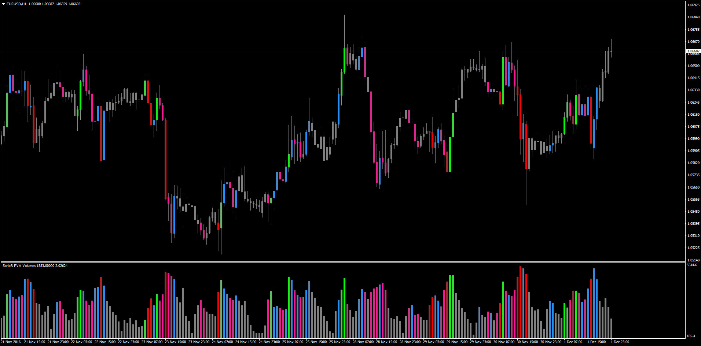

# PVA Overlay

> Source: https://fxcodebase.com/code/viewtopic.php?f=38&t=64164  
> Forum: 38 · Topic 64164 · 1 post(s)

---

## PVA Overlay

**Apprentice** · Fri Dec 02, 2016 4:35 am

MT2/Marketscope / Lua Version:
[viewtopic.php?f=17&t=60177#p91839](https://fxcodebase.com/code/viewtopic.php?f=17&t=60177#p91839)

Description:

This indicator will color the candles according to the volume colors used in the PVA indicator. Optional sound alert included when a new color appears.

 [PVA_Overlay.mq4](files/109370/PVA_Overlay.mq4)
