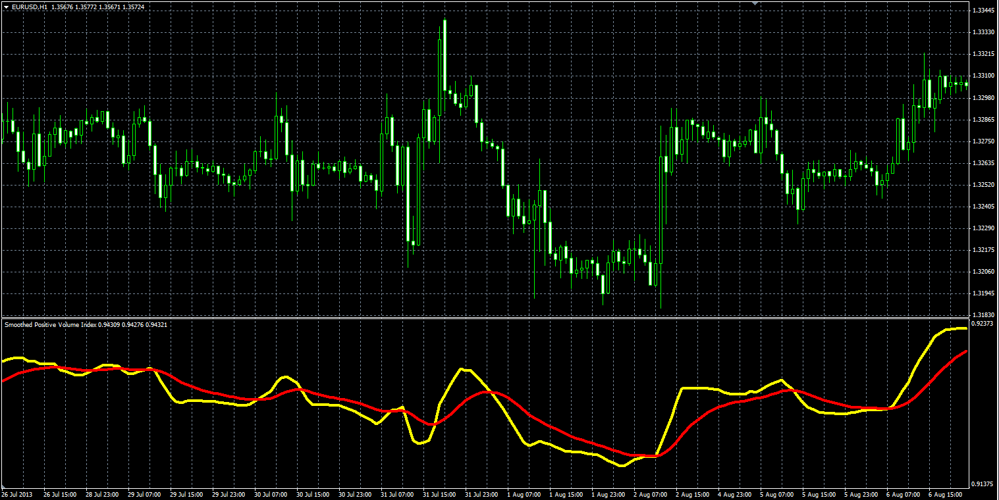

# PVI smoothed oscillator

> Source: https://fxcodebase.com/code/viewtopic.php?f=38&t=59618  
> Forum: 38 · Topic 59618 · 1 post(s)

---

## PVI smoothed oscillator

**Alexander.Gettinger** · Mon Oct 07, 2013 2:44 pm

This is a smoothed PVI indicator ([viewtopic.php?f=38&t=59616](https://fxcodebase.com/code/viewtopic.php?f=38&t=59616)).

Formulas:
Smoothed PVI = MVA(PVI, Smooth period),
Signal = EMA(Smoothed PVI, Signal period), where
PVI - Positive Volume Index.

 

Download:

 [PVI_Smoothed.mq4](files/89870/PVI_Smoothed.mq4)
