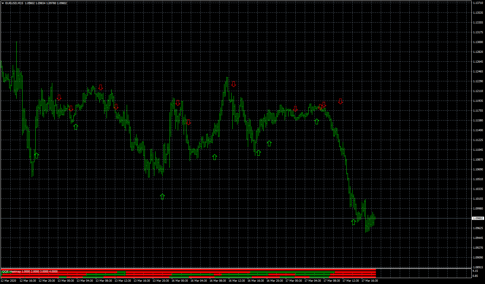

# QQE heatmap

> Source: https://fxcodebase.com/code/viewtopic.php?f=38&t=69544  
> Forum: 38 · Topic 69544 · 5 post(s)

---

## QQE heatmap

**Apprentice** · Tue Mar 17, 2020 1:08 pm

Based on request.
[viewtopic.php?f=27&t=69535](https://fxcodebase.com/code/viewtopic.php?f=27&t=69535)

 [QQE heatmap.mq4](files/132029/QQE%20heatmap.mq4)

 [qqe_new.mq4](files/132029/qqe_new.mq4)

---

## Re: QQE heatmap

**charlesu123** · Tue Mar 17, 2020 5:02 pm

Thank you so much for this indicator, i just have one request. Can you adjust the heat map, specifically can you take off/delete the arrows so it wont show on the chart please and thank you .

---

## Re: QQE heatmap

**Apprentice** · Wed Mar 18, 2020 4:36 am

Your request is added to the development list.
Development reference 896.

---

## Re: QQE heatmap

**Apprentice** · Thu Mar 19, 2020 6:27 am

[QQE heatmap.mq4](files/132082/QQE%20heatmap.mq4)

Try this version.

---

## Re: QQE heatmap

**charlesu123** · Thu Mar 19, 2020 10:57 am

Thank you and your team very much i really do appreciate it, this indicator is just how i wanted. i hope you all have a wonderful week
