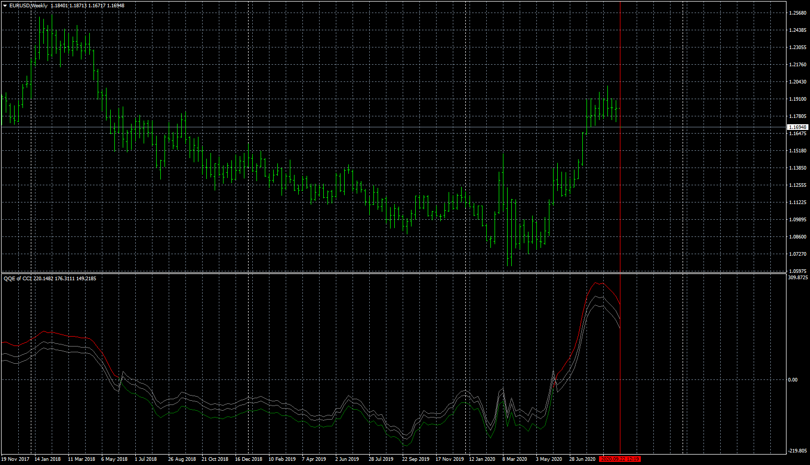

# QQE of CCI

> Source: https://fxcodebase.com/code/viewtopic.php?f=38&t=70474  
> Forum: 38 · Topic 70474 · 13 post(s)

---

## QQE of CCI

**Apprentice** · Wed Sep 23, 2020 2:40 am

TS2/Lua version.
[viewtopic.php?f=17&t=70463](https://fxcodebase.com/code/viewtopic.php?f=17&t=70463)

 [QQE of CCI.mq4](files/137837/QQE%20of%20CCI.mq4)

---

## Re: QQE of CCI

**yolerap** · Wed Sep 23, 2020 6:32 am

Thank you for rapidity !

Could you please create a strategy with the indicator ?
Buy when it's green
Sell when it's red

Please add the options Stop loss/take profit, breakeven, time trading, end of turn.

Thank you,

---

## Re: QQE of CCI

**Apprentice** · Wed Sep 23, 2020 9:09 am

Your request is added to the development list.
Development reference 2093.

---

## Re: QQE of CCI

**bartwas1** · Thu Sep 24, 2020 6:09 am

Hi Apprentice

I have got a question about this oscillator. I've had some issues with responding to price movement it wouldn't refresh automatically. It needed to be refreshed manually.

I compiled it in meta trader editor and it shows two warnings: possible loss of data due to type conversion

Bart

---

## Re: QQE of CCI

**Apprentice** · Sat Sep 26, 2020 1:54 am

Your request is added to the development list.
Development reference 2105.

---

## Re: QQE of CCI

**Apprentice** · Sat Sep 26, 2020 2:22 am

[QQE_of_CCI_ver1.mq4](files/137921/QQE_of_CCI_ver1.mq4)

 [QQE_of_CCI_Expert.mq4](files/137921/QQE_of_CCI_Expert.mq4)

---

## Re: QQE of CCI

**yolerap** · Sat Sep 26, 2020 9:23 am

Thank you very much,

Please sir, add the options for the QQE_of_CCI_Expert.mq4
- Time to trade
- %of account for lot size
- and the option " Choose which day and which hour for close ALL trades opened". I want close all the trade the every friday afternoon and eventually an other day during the week.

Thank you for your attention,

---

## Re: QQE of CCI

**Apprentice** · Sun Sep 27, 2020 1:49 pm

Your request is added to the development list.
Development reference 2113.

---

## Re: QQE of CCI

**yolerap** · Sun Oct 04, 2020 2:05 pm

Thank you man but there is a problem with the EA because there are only buy position which taken whatever the parameters.

Could you please repair this EA and allow Sell and Buy positions ?

Thank you,

---

## Re: QQE of CCI

**Apprentice** · Mon Oct 05, 2020 9:00 am

Your request is added to the development list.
Development reference 2140.

---

## Re: QQE of CCI

**yolerap** · Thu Oct 15, 2020 2:22 am

Hi Apprentice,

Sorry but the strategy takes always only long positions. I already download the new version. Maybe the indicator need to be refresh in the code of the strategy like a repaint indicator ? Could you check it please ?

Thank you again,

---

## Re: QQE of CCI

**Apprentice** · Fri Oct 16, 2020 7:33 am

Your request is added to the development list.
Development reference 2198.

---

## Re: QQE of CCI

**Apprentice** · Mon Oct 19, 2020 5:47 am

[QQE_of_CCI_ver1.mq4](files/138337/QQE_of_CCI_ver1.mq4)

 [QQE_of_CCI_Expert_ver1.mq4](files/138337/QQE_of_CCI_Expert_ver1.mq4)

Try this version.
