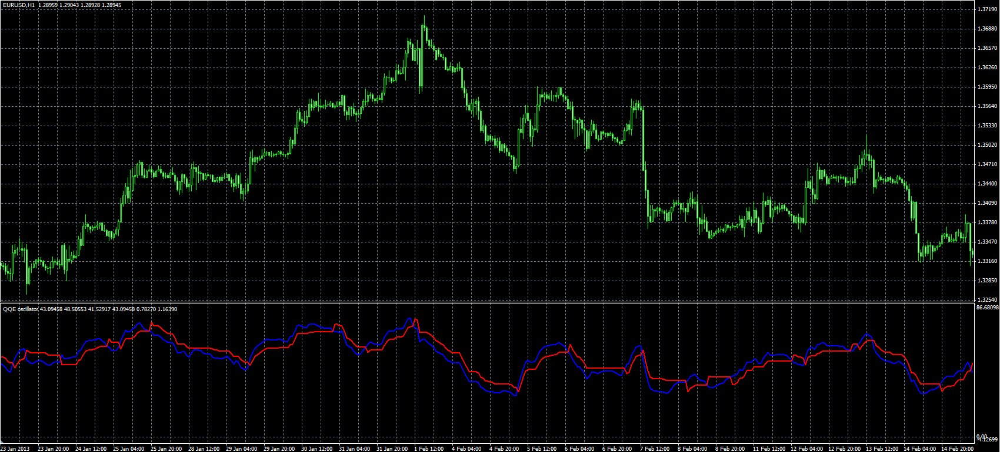
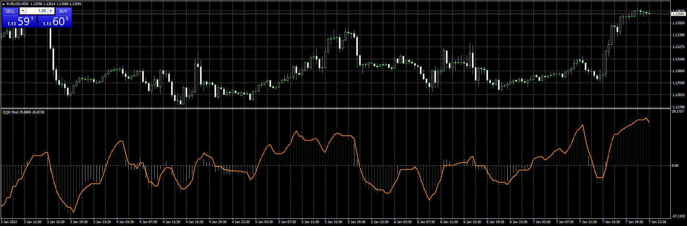

# QQE oscillator

> Source: https://fxcodebase.com/code/viewtopic.php?f=38&t=34365  
> Forum: 38 · Topic 34365 · 16 post(s)

---

## QQE oscillator

**Alexander.Gettinger** · Wed Apr 10, 2013 4:17 pm

Original indicator: [viewtopic.php?f=17&t=34069](https://fxcodebase.com/code/viewtopic.php?f=17&t=34069)

 

Download:

 [QQE.mq4](files/58605/QQE.mq4)

 [Double QQE.mq4](files/58605/Double%20QQE.mq4)

---

## Re: QQE oscillator

**martc911** · Tue Jul 23, 2013 5:06 am

Hi, I use the QQE indicator all the time, could you add an alert when the red signal line crosses over the 50 level and could the sound be selected from a personal choice. Too many alerts all use the same sound file. Cheers

---

## Re: QQE oscillator

**Apprentice** · Sat Jul 27, 2013 2:53 am

Your request is added to the development list.

---

## QQE adv alert

**lucky_trader** · Sun Aug 11, 2013 6:20 am

hi everyone
i don't know difference QQE ADV and QQE OSC.. but i need :
1- custom (adjustable)alert/alarm for QQE ADV in MT4 when rsi(blue) line is crossed red signal(dotted) line and 50 level in same direction(sell or buy).
2- QQE ADV or a line similare than signal(dotted) line in ANDROID MOBILE.
3- FOREX-REBELLIONE E.A. with lot size( to get position).

NOTE: i didn't see QQE OSC. in developement list !

---

## Re: QQE oscillator

**Apprentice** · Mon Aug 12, 2013 4:24 am

Your request is added to the development list.

---

## Re: QQE oscillator

**waleeed1** · Mon Mar 07, 2016 5:28 am

could the sound be selected from a personal choice. Too many alerts all use the same sound file. Cheers

---

## Re: QQE oscillator

**waleeed12** · Thu Mar 24, 2016 8:28 am

Too many alerts all use the same sound file. Cheers

---

## Re: QQE oscillator

**Alexander.Gettinger** · Fri Feb 22, 2019 2:25 pm

Please try this indicator:

 [QQE_with_Alert.mq4](files/124072/QQE_with_Alert.mq4)

---

## Re: QQE oscillator

**googoo** · Tue Aug 04, 2020 11:00 pm

Hi, I am having an issue with the Double QQE indicator.

After loaded up the Double QQE indicator, my mt4 would felt like 'heavy'/not so smooth and mt4 only became normal again once i removed the indicator.

Is it normal for the mt4 to have such behave with the Double QQE.mq4 and is there any recommend/suggestion for the issue mentioned?

---

## Re: QQE oscillator

**Apprentice** · Wed Aug 05, 2020 4:13 am

Your request is added to the development list.
Development reference 1829.

---

## Re: QQE oscillator

**Apprentice** · Thu Aug 06, 2020 6:05 am

Try this version.

 [Double QQE.mq4](files/136644/Double%20QQE.mq4)

---

## Re: QQE oscillator

**googoo** · Sun Aug 09, 2020 8:15 am

It's working great now. Thank you very much Apprentice!

---

## Re: QQE oscillator

**Mactormind** · Sun Jan 09, 2022 4:21 am

Hey all, been trying to add this indicator to my chart. However, once added and click OK, nothing happens. Is there an updated version of Double QQE that I can try?

---

## Re: QQE oscillator

**Apprentice** · Sun Jan 09, 2022 4:48 am

Works without problem on MT4.
Make sure to install QQE.MQ4

---

## Re: QQE oscillator

**Mactormind** · Sun Jan 09, 2022 5:02 am

> **Apprentice wrote:**
>
>
> eurusd-m30-fxcm-australia-pty.png
>
>
> Works without problem on MT4.
> Make sure to install QQE.MQ4

Holy hell I didnt install the first QQE! FML. Thank you!

---

## Re: QQE oscillator

**Mactormind** · Sun Jan 09, 2022 7:05 pm

> **Apprentice wrote:**
>
>
> eurusd-m30-fxcm-australia-pty.png
>
>
> Works without problem on MT4.
> Make sure to install QQE.MQ4

Is there a way to make it so changes to color settings will save? Whenever I change settings then switch to another symbol or TF it reverts back to default. Or is this just not happening for me...
