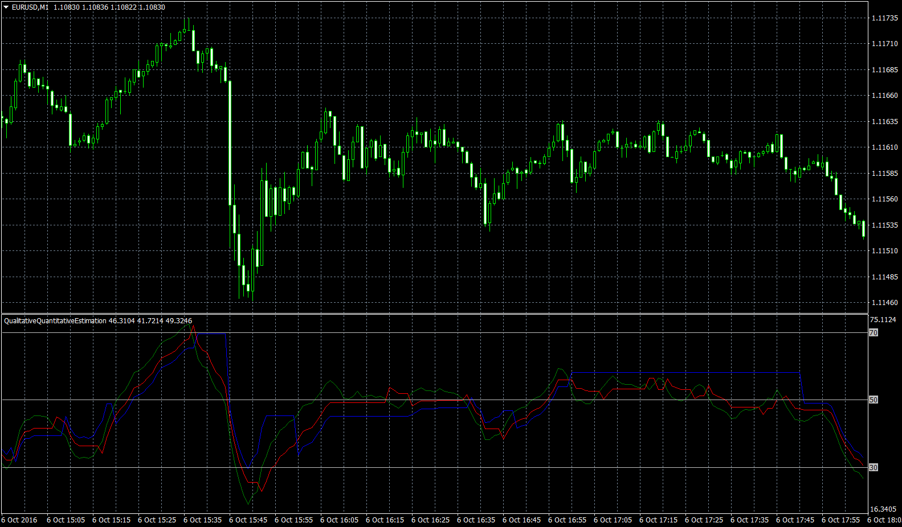

# QualitativeQuantitativeEstimation

> Source: https://fxcodebase.com/code/viewtopic.php?f=38&t=63956  
> Forum: 38 · Topic 63956 · 3 post(s)

---

## QualitativeQuantitativeEstimation

**Apprentice** · Tue Oct 11, 2016 6:54 am

Based on.
[viewtopic.php?f=17&t=1347](https://fxcodebase.com/code/viewtopic.php?f=17&t=1347)

Qualitative Quantitative Estimation (QQE) is a smoothed RSI.

Trailing stop is a smoothed ATR multiplied by a factor of 2.618 or, and 4.236,
ATR indicator is based on the EMA of RSI.

QQE trading signals.

Crossovers
RSI /Trailing stop Crossover

Overbought/Oversold
Level are 30 and 70

Divergence
Bullish Divergence - Long
Lower lows in price and higher lows in the QQE.

Bearish Divergence - Short
Higher highs in price and lower highs in the QQE.

 [QualitativeQuantitativeEstimation.mq4](files/108514/QualitativeQuantitativeEstimation.mq4)

---

## Re: QualitativeQuantitativeEstimation

**protrader021** · Sun Jan 03, 2021 8:10 am

hi do we have lua version of this indicator?

---

## Re: QualitativeQuantitativeEstimation

**Apprentice** · Mon Jan 04, 2021 4:17 am

It is posted here.
[viewtopic.php?f=17&t=1347](https://fxcodebase.com/code/viewtopic.php?f=17&t=1347)
