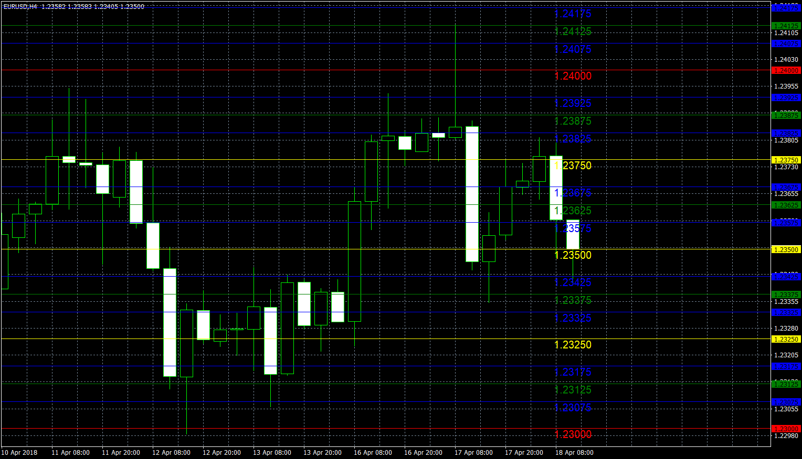

# Quarters_Theory

> Source: https://fxcodebase.com/code/viewtopic.php?f=38&t=66218  
> Forum: 38 · Topic 66218 · 11 post(s)

---

## Quarters_Theory

**Apprentice** · Fri Jun 22, 2018 7:16 am

TS2/Lua original
[viewtopic.php?f=17&t=65158](https://fxcodebase.com/code/viewtopic.php?f=17&t=65158)

 [Quarters_Theory.mq4](files/119676/Quarters_Theory.mq4)

---

## Re: Quarters_Theory

**lanreakinsiun** · Fri Jun 22, 2018 10:37 am

WOW! Lovely, I like the fact that you added those options to change line colours and width. Can you please remove the label inside the chart and and also, can you include option to change the style of each line?

Thanks a lot. Really appreciate.

---

## Re: Quarters_Theory

**nicetees** · Fri Jun 22, 2018 6:47 pm

Thanks again Sir. Excellent work and fast turnaround!

---

## Re: Quarters_Theory

**lanreakinsiun** · Tue Jun 26, 2018 9:08 am

Please can you remove the chart label inside the chart, and I will appreciate if you can you please include **option to change the style** of each line from straight line to dotted lines?

Thank you so very much.

---

## Re: Quarters_Theory

**Apprentice** · Thu Jun 28, 2018 3:47 pm

Your request is added to the development list under Id Number 4171

---

## Re: Quarters_Theory INDICATOR OPEN QUARTER

**syncoopate** · Sat Jun 30, 2018 2:32 pm

HELLO,
IT IS POSSIBLE TO HAVE AN INDICATOR THAT I DRAW THE OPEN QUARTERLY (OPEN JANUARY, OPEN APRIL, OPEN JULY, OPEN OCTOBER) THE VISIBLE LINE ONLY IN THE QUARTER.
THANKS FRIENDS

---

## Re: Quarters_Theory

**Apprentice** · Mon Jul 02, 2018 4:28 am

Your request is added to the development list under Id Number 4175

---

## Re: Quarters_Theory

**Apprentice** · Tue Jul 03, 2018 4:59 am

[Quarters_Theory 4171.mq4](files/119785/Quarters_Theory%204171.mq4)

 [Quarters_Theory 4175.mq4](files/119785/Quarters_Theory%204175.mq4)

Try it now.

---

## Re: Quarters_Theory

**syncoopate** · Tue Jul 03, 2018 7:14 am

Thanks Mario, but I wanted a simple indicator .... I have to draw only the open quarterly( whith label of price at extreme right of the chart) from the beginning of the quarter until the end of the quarter .... for all the dates available on the chart: D
 I add equidistant levels n% from the opening
Thank's my friend

---

## Re: Quarters_Theory

**syncoopate** · Tue Jul 03, 2018 7:27 am

Mario, this is the indicator ..... open line of the time frame (option1 week, option2 month, option 3 quarter) single level selection or 2 or 3 together.
For each time frame 2 distances% 1 up and 1 down (draw minimum 4 equidistant lines up and 4 draw minimum 4 equidistant lines down)

Help Me amico mio

---

## Re: Quarters_Theory

**Apprentice** · Wed Jul 04, 2018 1:51 pm

Your request is added to the development list under Id Number 4178
