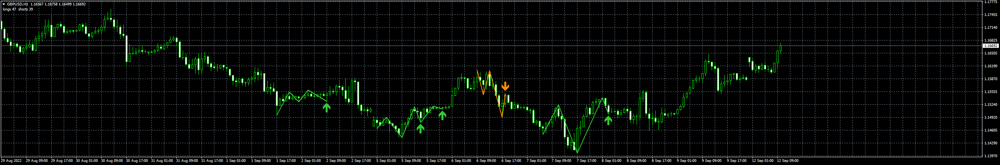
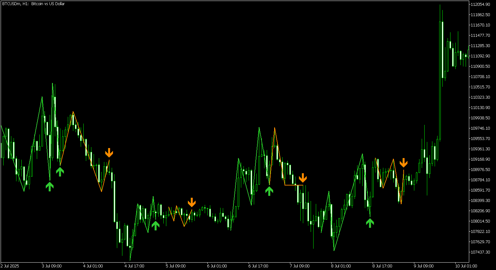
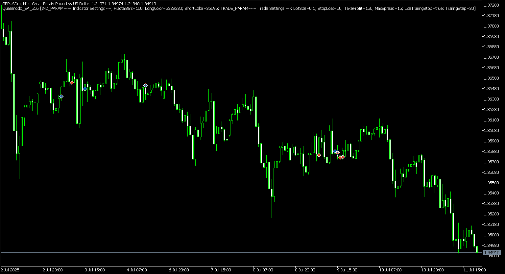
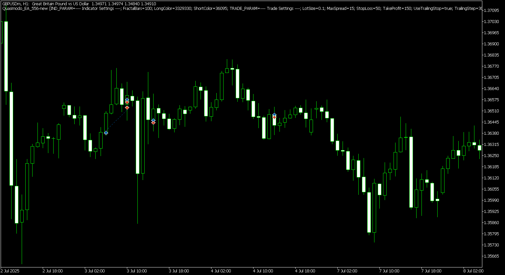

# Quasimodo_Indicator

> Source: https://fxcodebase.com/code/viewtopic.php?f=38&t=72707  
> Forum: 38 · Topic 72707 · 5 post(s)

---

## Quasimodo_Indicator

**Apprentice** · Mon Sep 12, 2022 2:06 am

 

 

 [Quasimodo_Indicator.mq4](files/147422/Quasimodo_Indicator.mq4)

 [Quasimodo_EA.mq4](files/147422/Quasimodo_EA.mq4)

---

## Re: Quasimodo_Indicator

**forextraderaz** · Mon Sep 12, 2022 10:23 am

Can you post MT5 version of the indicator and EA? Thanks

---

## Re: Quasimodo_Indicator

**mutouren** · Wed Sep 14, 2022 7:41 pm

2022.09.15 08:39:29.667	Quasimodo_Indicator EURUSD,H1: array out of range in 'Quasimodo_Indicator.mq4' (241,24)
2022.09.15 08:40:14.091	Quasimodo_Indicator EURUSD,M15: array out of range in 'Quasimodo_Indicator.mq4' (253,24)
2022.09.15 08:40:45.781	Quasimodo_Indicator EURUSD,M5: array out of range in 'Quasimodo_Indicator.mq4' (241,24)

---

## Re: Quasimodo_Indicator

**Apprentice** · Thu Sep 15, 2022 5:12 am

We have added your request to the development list.
Development reference 556.

---

## Re: Quasimodo_Indicator

**Apprentice** · Wed Jul 16, 2025 3:26 am

 

 

 [Quasimodo_Indicator.mq5](files/159933/Quasimodo_Indicator.mq5)

 [Quasimodo_EA.mq5](files/159933/Quasimodo_EA.mq5)
