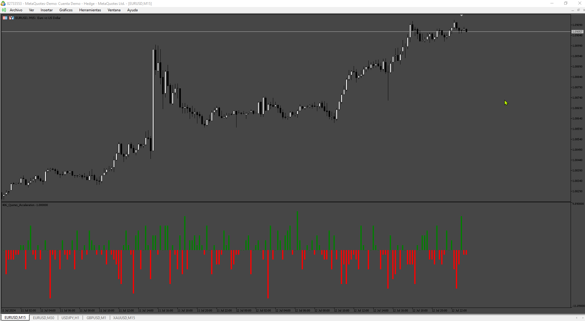
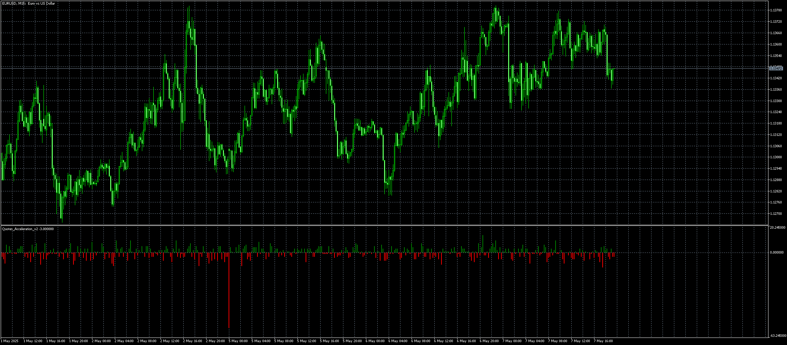

# Quotes_Acceleration

> Source: https://fxcodebase.com/code/viewtopic.php?f=38&t=75064  
> Forum: 38 · Topic 75064 · 6 post(s)

---

## Quotes_Acceleration

**Apprentice** · Sat Jul 13, 2024 3:11 am

Based on the request.
[https://fxcodebase.com/code/viewtopic.p ... 26#p155426](https://fxcodebase.com/code/viewtopic.php?f=17&p=155426#p155426)

 [Quotes_Acceleration.mq5](files/156135/Quotes_Acceleration.mq5)

---

## Re: Quotes_Acceleration

**logicgate** · Sat Aug 10, 2024 4:44 am

Awesome, thanks buddy!

---

## Re: Quotes_Acceleration

**logicgate** · Sat Aug 10, 2024 4:49 am

Can you please add a setting:

Polarized: Yes/No

Because I don't think that the data is meant to be looked at that way, give you are comparing the acceleration of bars without taking in consideration positive/negative values.

---

## Re: Quotes_Acceleration

**Apprentice** · Sat Aug 10, 2024 6:54 pm

We have added your request to the development list.
Development reference 638

---

## Re: Quotes_Acceleration

**logicgate** · Thu Nov 21, 2024 4:40 am

Hello dear friend Apprentice, there is something wrong with the indicator.

The colors are swapped:

What should be red is green, and what should be a positive value is a negative value in the histogram.

And please add the option to turn on and off the polarized plotting.

Best regards

---

## Re: Quotes_Acceleration

**Apprentice** · Wed May 07, 2025 11:31 am

 [Quotes_Acceleration_v2.mq5](files/159146/Quotes_Acceleration_v2.mq5)
