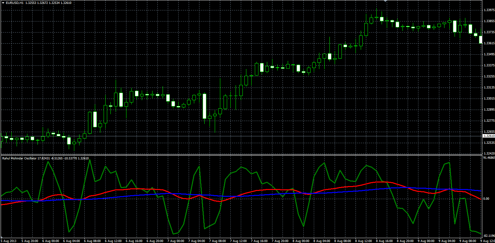
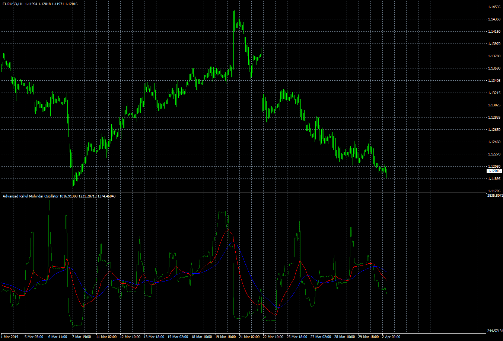

# Rahul Mohindar Oscillator

> Source: https://fxcodebase.com/code/viewtopic.php?f=38&t=59124  
> Forum: 38 · Topic 59124 · 5 post(s)

---

## Rahul Mohindar Oscillator

**Alexander.Gettinger** · Wed Aug 14, 2013 2:46 pm

Original LUA oscillator: [viewtopic.php?f=17&t=41106](https://fxcodebase.com/code/viewtopic.php?f=17&t=41106).

Formulas:
RMO[i] = 100*x/(MaxPr-MinPr),
First signal = EMA(RMO, Length1),
Second signal = EMA(First signal, Length2), where
x[i] = Price[i]-(10*Price[i]+55*Price[i-1]+165*Price[i-2]+330*Price[i-3]+462*Price[i-4]+462*Price[i-5]+330*Price[i-6]+165*Price[i-7]+55*Price[i-8]+11*Price[i-9]+*Price[i-10])/2046,
MaxPr, MinPr - maximum and minimum prices at range from (i-10) to i.

 

Download:

 [RMO.mq4](files/88575/RMO.mq4)

 

 [Advanced RMO.mq4](files/88575/Advanced%20RMO.mq4)

---

## Re: Rahul Mohindar Oscillator

**martc911** · Tue Oct 29, 2013 5:45 am

Hi There, this is a cracking indicator and I am getting some great trades using it Thanks.

However, can you make it even better by adding an alert when the green line crosses over the 2 MACD lines. Can you code it so that I can add my own sound files please.

Thanks for all the great stuff you do

---

## Re: Rahul Mohindar Oscillator

**Apprentice** · Thu Oct 31, 2013 12:03 pm

Your request is added to the development list.

---

## Re: Rahul Mohindar Oscillator

**Alexander.Gettinger** · Mon Dec 17, 2018 10:47 pm

Please try this version of the indicator:

 [RMO.mq4](files/122906/RMO.mq4)

---

## Re: Rahul Mohindar Oscillator

**Apprentice** · Mon Apr 08, 2019 7:37 am

Advanced RMO.mq4 added.
