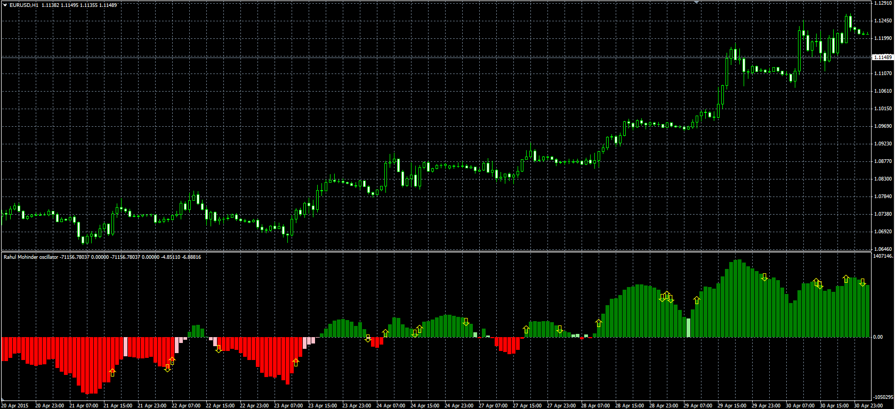

# Rahul Mohinder Oscillator histogram

> Source: https://fxcodebase.com/code/viewtopic.php?f=38&t=62197  
> Forum: 38 · Topic 62197 · 1 post(s)

---

## Rahul Mohinder Oscillator histogram

**Alexander.Gettinger** · Fri May 08, 2015 10:08 am

Original LUA oscillator: [viewtopic.php?f=17&t=62128](https://fxcodebase.com/code/viewtopic.php?f=17&t=62128).

Formula:
RMO = EMA(SwingTrd) with [Length3] number of periods, where
SwingTrd = 100*(Price-MA_Avg)/(Max-Min),
MA_Avg = (MA1+MA2+MA3+MA4+MA5+MA6+MA7+MA8+MA9+MA10)/10,
MA10[i] = (MA9[i]+MA9[i-1])/2,
MA9[i] = (MA8[i]+MA8[i-1])/2,
MA8[i] = (MA7[i]+MA7[i-1])/2,
MA7[i] = (MA6[i]+MA6[i-1])/2,
MA6[i] = (MA5[i]+MA5[i-1])/2,
MA5[i] = (MA4[i]+MA4[i-1])/2,
MA4[i] = (MA3[i]+MA3[i-1])/2,
MA3[i] = (MA2[i]+MA2[i-1])/2,
MA2[i] = (MA1[i]+MA1[i-1])/2,
MA1[i] = (Price[i]+Price[i-1])/2,
Max, Min - maximum and minimum prices at range from (i-9) to (i).

 

Download:

 [Rahul_Mohinder_Osc.mq4](files/100356/Rahul_Mohinder_Osc.mq4)
