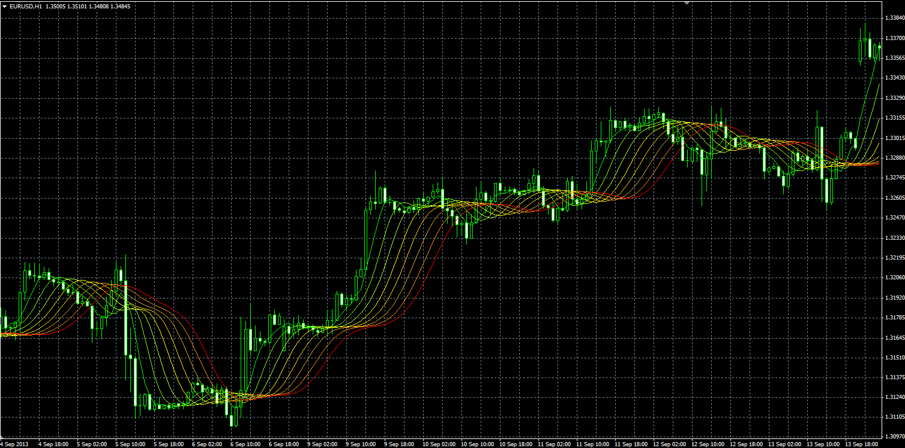
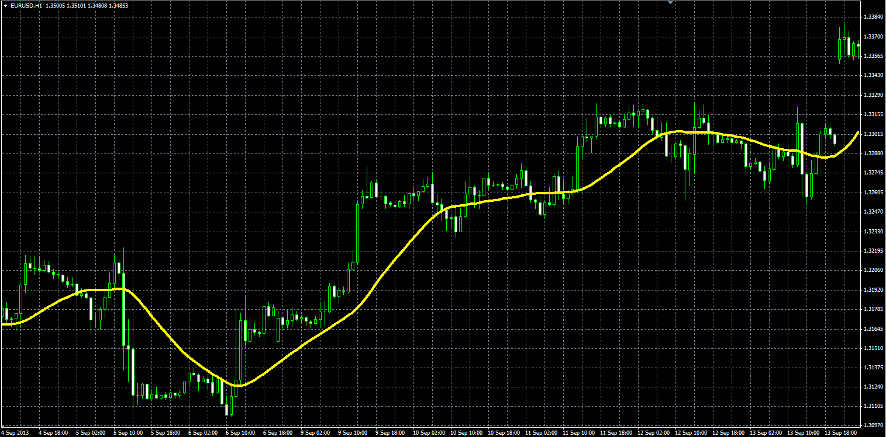
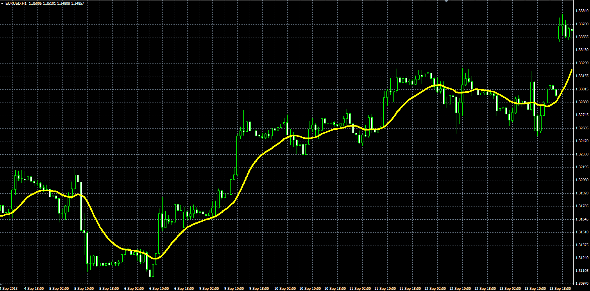
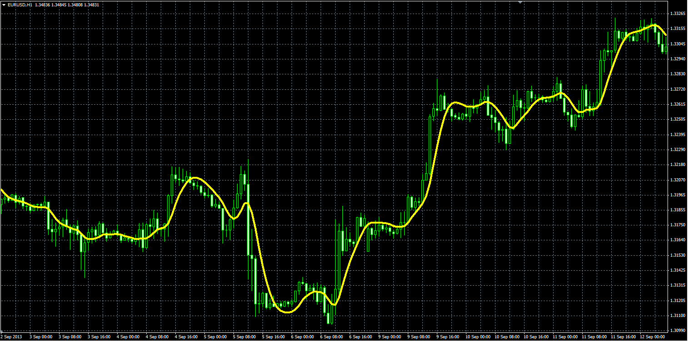

# Rainbow indicators

> Source: https://fxcodebase.com/code/viewtopic.php?f=38&t=59591  
> Forum: 38 · Topic 59591 · 4 post(s)

---

## Rainbow indicators

**Alexander.Gettinger** · Thu Sep 26, 2013 3:11 pm

Formulas:
MA1 = MA(Price),
MA2 = MA(MA1),
MA3 = MA(MA2),
MA4 = MA(MA3),
MA5 = MA(MA4),
MA6 = MA(MA5),
MA7 = MA(MA6),
MA8 = MA(MA9).

 

Download:

 [MA_Rainbow.mq4](files/89727/MA_Rainbow.mq4)

---

## Re: Rainbow indicators

**Alexander.Gettinger** · Thu Sep 26, 2013 3:16 pm

**Average rainbow:**

Formulas:
Average rainbow = (MA[1]+MA[2]+...+MA[Number])/Number, where
MA[1] = MA(Price),
MA[2] = MA(MA[1]),
.......................
MA[N] = MA(MA[N-1]).

 

Download:

 [Averaged_Rainbow.mq4](files/89728/Averaged_Rainbow.mq4)

For this indicator must be installed MA_Rainbow indicator.

---

## Re: Rainbow indicators

**Alexander.Gettinger** · Thu Sep 26, 2013 3:20 pm

**Mel Widner Averaged Rainbow:**

Formula:
Average Rainbow = (5*MA[1] +4*MA[2]+3*MA[3] +2*MA[4] +MA[5] ... + MA[10]) /20.

 

Download:

 [Mel_Widner_Averaged_Rainbow.mq4](files/89729/Mel_Widner_Averaged_Rainbow.mq4)

For this indicator must be installed MA_Rainbow indicator.

---

## Re: Rainbow indicators

**Alexander.Gettinger** · Thu Sep 26, 2013 3:24 pm

**Zero lag rainbow:**

Formulas:
Zero lag rainbow = MA[1]+Diff, where
MA[1] = MA(Mel Widner Averaged Rainbow),
Diff = MA[2]-MA[1],
MA[2] = MA(MA[1]).

 

Download:

 [Zero_Lag_Rainbow.mq4](files/89730/Zero_Lag_Rainbow.mq4)

For this indicator must be installed MA_Rainbow indicator and Mel Widner Averaged Rainbow.
