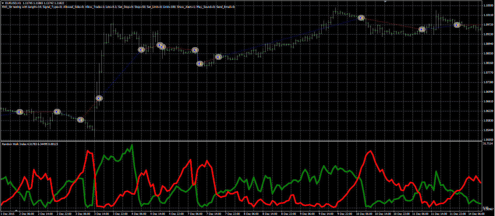

# Random walk index strategy

> Source: https://fxcodebase.com/code/viewtopic.php?f=38&t=63585  
> Forum: 38 · Topic 63585 · 1 post(s)

---

## Random walk index strategy

**Alexander.Gettinger** · Thu Jun 09, 2016 5:08 pm

The strategy based on the Random Walk Index ([viewtopic.php?f=38&t=20875&p=36563](https://fxcodebase.com/code/viewtopic.php?f=38&t=20875&p=36563)).

Buy condition: RWI High crosses above RWI Low.
Sell condition: RWI High crosses under RWI Low.

 

Download:

 [RWI_Str.mq4](files/106703/RWI_Str.mq4)

The Random Walk Index ([viewtopic.php?f=38&t=20875&p=36563](https://fxcodebase.com/code/viewtopic.php?f=38&t=20875&p=36563)) should be installed for correct work.
