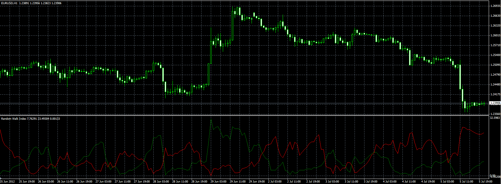

# Random Walk Index

> Source: https://fxcodebase.com/code/viewtopic.php?f=38&t=20875  
> Forum: 38 · Topic 20875 · 4 post(s)

---

## Random Walk Index

**Alexander.Gettinger** · Thu Jul 05, 2012 4:52 pm

Original indicator: [viewtopic.php?f=17&t=1166](https://fxcodebase.com/code/viewtopic.php?f=17&t=1166)

> Random Walk Index (RWI) determines if a security is is trending (uptrend or downtrend) or is in a random trading range..
>
> The random walk index (RWI) is a technical indicator that attempts to determine if a stock's price movement is random or nature or a result of a statistically significant trend.
>
> RANDOM WALK INDEX FORMULA
> High = MAX((High - Low(n)) / (ATR(n) * SQRT(n)))
> Low = MAX((High(n) - Low) / (ATR(n) * SQRT(n)))
>
> The random walk index (RWI) by E. Michael Poulos is a measure of how much price ranges over N days differ from what would be expected by a random walk (randomly going up and down).
> A bigger than expected range suggests a trend.

 

Download:

 [RWI.mq4](files/36563/RWI.mq4)

---

## Re: Random Walk Index

**durlovjagiroad** · Sun Mar 15, 2020 2:39 pm

need RWI with multi-timeframe

---

## Re: Random Walk Index

**Apprentice** · Mon Mar 16, 2020 5:13 am

Your request is added to the development list.
Development reference 871.

---

## Re: Random Walk Index

**Apprentice** · Tue Mar 17, 2020 1:04 pm

[RWI BTF.mq4](files/132028/RWI%20BTF.mq4)

Try this version.
