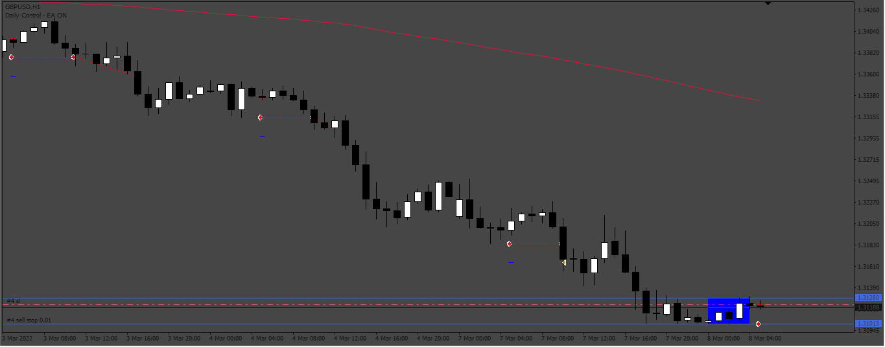
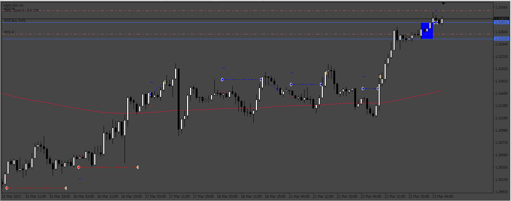

# Range_Breackout_EA

> Source: https://fxcodebase.com/code/viewtopic.php?f=38&t=74698  
> Forum: 38 · Topic 74698 · 5 post(s)

---

## Range_Breackout_EA

**Apprentice** · Sat Mar 16, 2024 2:02 pm

 

Based on the request.
[https://fxcodebase.com/code/viewtopic.php?f=27&p=154629](https://fxcodebase.com/code/viewtopic.php?f=27&p=154629)

 [Range_Breackout_EA.mq4](files/154705/Range_Breackout_EA.mq4)

 [Range_Breackout_EA.mq5](files/154705/Range_Breackout_EA.mq5)

---

## Re: Range_Breackout_EA

**alizon** · Fri Mar 22, 2024 2:06 pm

Can you make this for MT5 version? Thank you

---

## Re: Range_Breackout_EA

**alizon** · Fri Mar 22, 2024 2:07 pm

> **Apprentice wrote:**
>
>
> 219.png
>
>
>
>
> 219_buy.png
>
>
> Based on the request.
> [https://fxcodebase.com/code/viewtopic.php?f=27&p=154629](https://fxcodebase.com/code/viewtopic.php?f=27&p=154629)
>
>
> Range_Breackout_EA.mq4

Can you make this ea for mt5 version? Thank you

---

## Re: Range_Breackout_EA

**Apprentice** · Wed Mar 27, 2024 10:33 am

We have added your request to the development list.
Development reference 274

---

## Re: Range_Breackout_EA

**Apprentice** · Wed Oct 29, 2025 4:02 pm

MT5 version added.
