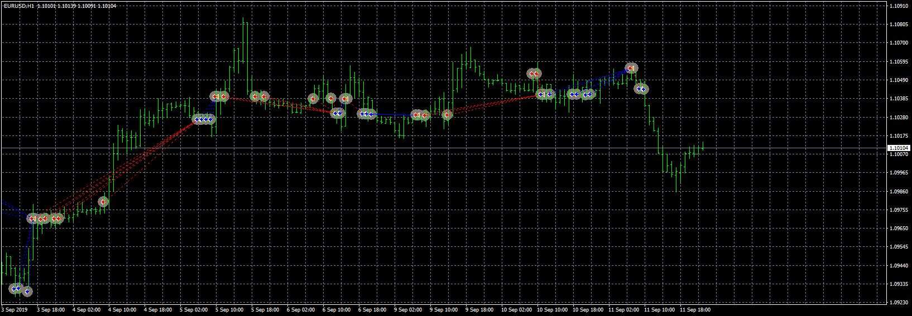
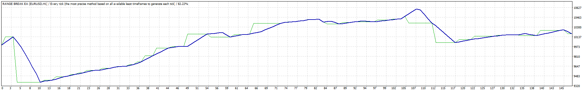
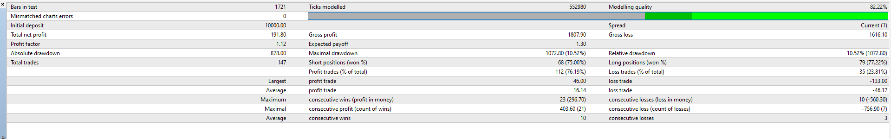

# RANGE BREAK EA

> Source: https://fxcodebase.com/code/viewtopic.php?f=38&t=68905  
> Forum: 38 · Topic 68905 · 3 post(s)

---

## RANGE BREAK EA

**Apprentice** · Thu Sep 12, 2019 6:33 am

 

 

Based on request
[viewtopic.php?f=27&t=68898](https://fxcodebase.com/code/viewtopic.php?f=27&t=68898)

 [RANGE BREAK EA.mq4](files/128594/RANGE%20BREAK%20EA.mq4)

---

## Re: RANGE BREAK EA

**SEMJUNIOR** · Thu Sep 12, 2019 1:36 pm

Thank you for this complex work in no time. However, I have some difficulties with my goals. The robot should take a position mid-way outside the range zone (high and low candle between 00h00 to 05h30).
For example, I have a candle that starts above the range, so the robot must take a long position. I will add a complementary image. THANK YOU

---

## Re: RANGE BREAK EA

**Apprentice** · Mon Sep 16, 2019 3:28 am

Long & short conditions swapped.
