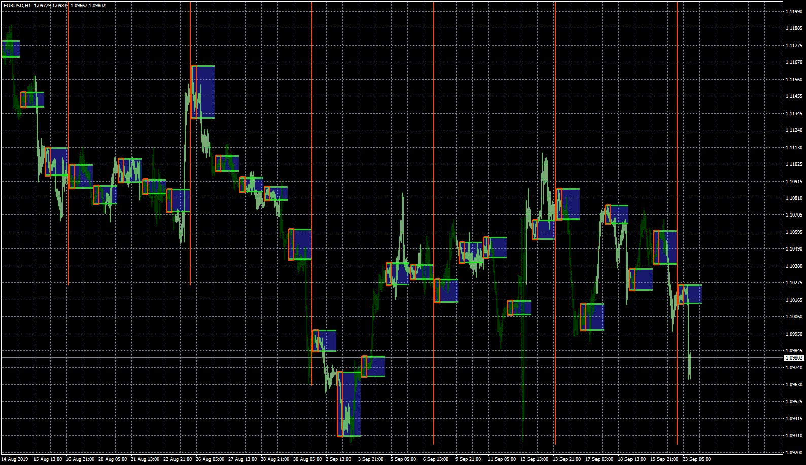

# RANGE_BREAK

> Source: https://fxcodebase.com/code/viewtopic.php?f=38&t=68970  
> Forum: 38 · Topic 68970 · 4 post(s)

---

## RANGE_BREAK

**Apprentice** · Wed Oct 02, 2019 4:11 am

Based on request.
[viewtopic.php?f=27&t=68940](https://fxcodebase.com/code/viewtopic.php?f=27&t=68940)

 [RANGE_BREAK.mq4](files/128935/RANGE_BREAK.mq4)

TS2 version
[https://fxcodebase.com/code/viewtopic.php?f=17&t=74256](https://fxcodebase.com/code/viewtopic.php?f=17&t=74256)

---

## Re: RANGE_BREAK

**superleo** · Sun Sep 17, 2023 10:45 pm

Hi apprentice,

Can u create this indicator for trading station

Thank u.

---

## Re: RANGE_BREAK

**Apprentice** · Mon Sep 25, 2023 3:29 am

We have added your request to the development list.
Development reference 876.

---

## Re: RANGE_BREAK

**Apprentice** · Mon Oct 16, 2023 11:18 am

TS2 version
[https://fxcodebase.com/code/viewtopic.php?f=17&t=74256](https://fxcodebase.com/code/viewtopic.php?f=17&t=74256)
