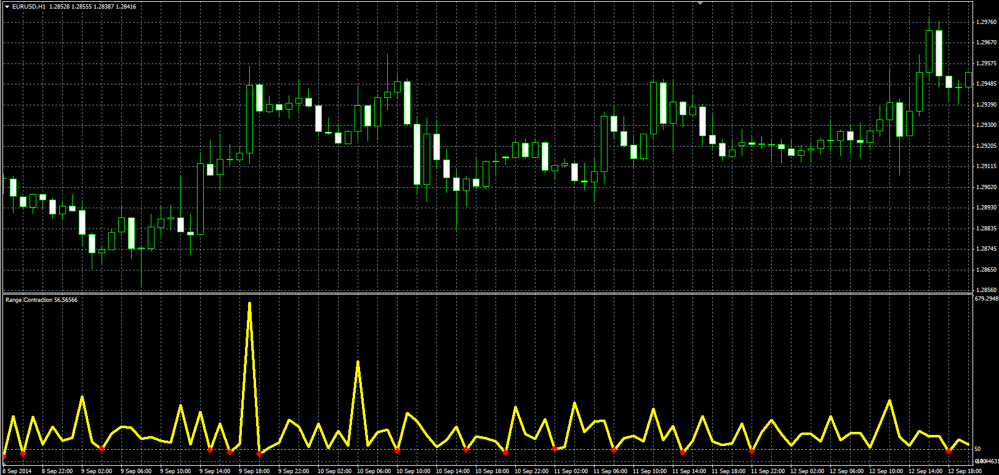

# Range Contraction

> Source: https://fxcodebase.com/code/viewtopic.php?f=38&t=61212  
> Forum: 38 · Topic 61212 · 12 post(s)

---

## Range Contraction

**Alexander.Gettinger** · Mon Sep 22, 2014 9:33 am

Original LUA oscillator: [viewtopic.php?f=17&t=61062](https://fxcodebase.com/code/viewtopic.php?f=17&t=61062).

Formula:
RC[i] = 100*(High[i]-Low[i])/(High[i-1]-Low[i-1]).

 

Download:

 [Range_Contraction.mq4](files/96068/Range_Contraction.mq4)

 [Range_Contraction_Expert.mq4](files/96068/Range_Contraction_Expert.mq4)

---

## Re: Range Contraction

**Protrader** · Tue Aug 18, 2020 6:16 pm

Hi Apprentice,

Is it possible to create an EA with this old indicator please ?

Entry conditions are :

First, looking to red points on the indicator.
Buy when there is red point (on the indicator) and green current candle.
Sell when there is red point (on the indicator) and red current candle.
Open the position at the start of the next candle.

So, for example ( we are at H1 timeframe ), if the range contraction gives a red point at 05:00 and the current candle at 05:00 close red -> Open short at the close of this red candle.

Please, add the stop/limit/breakeven/trailing options. Please, let the user to choose the threshold.

Thank you,

---

## Re: Range Contraction

**Apprentice** · Wed Aug 19, 2020 3:38 am

Your request is added to the development list.
Development reference 1906.

---

## Re: Range Contraction

**Apprentice** · Thu Aug 20, 2020 9:38 am

Range_Contraction_Expert.ex4 added.

---

## Re: Range Contraction

**Protrader** · Thu Aug 20, 2020 9:54 am

Thank you but sorry but 0 positions are opened :/

Doesn't open position on demo and backtest :/

---

## Re: Range Contraction

**Apprentice** · Fri Aug 21, 2020 5:47 am

Do you have Range_Contraction.mq4 indicator installed?

---

## Re: Range Contraction

**Protrader** · Mon Aug 24, 2020 2:23 pm

Yes, I had

---

## Re: Range Contraction

**Apprentice** · Tue Aug 25, 2020 5:35 am

Your request is added to the development list.
Development reference 1928.

---

## Re: Range Contraction

**Apprentice** · Mon Aug 31, 2020 8:55 am

Try it now.

---

## Re: Range Contraction

**Protrader** · Thu Sep 03, 2020 5:55 am

Sorry but error 130 appears.. There is no trade open

---

## Re: Range Contraction

**Apprentice** · Fri Sep 04, 2020 1:53 am

Your request is added to the development list.
Development reference 1971.

---

## Re: Range Contraction

**Apprentice** · Mon Sep 07, 2020 3:18 am

Stop Loss needs to be increased.
