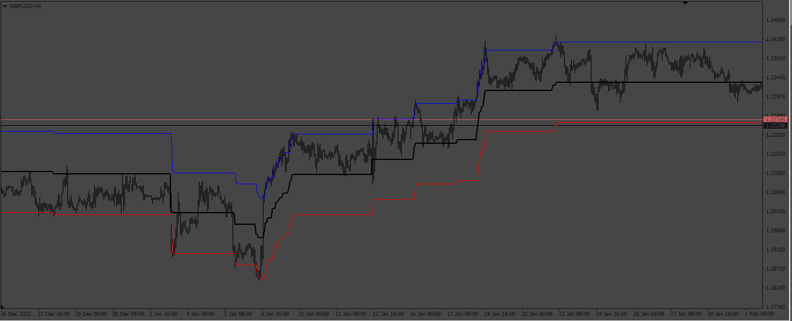
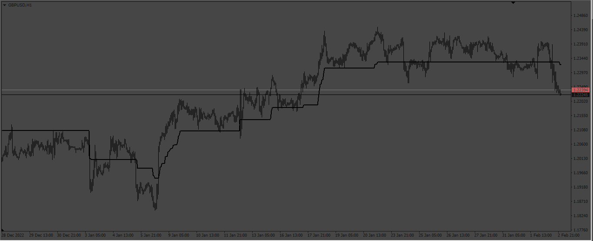
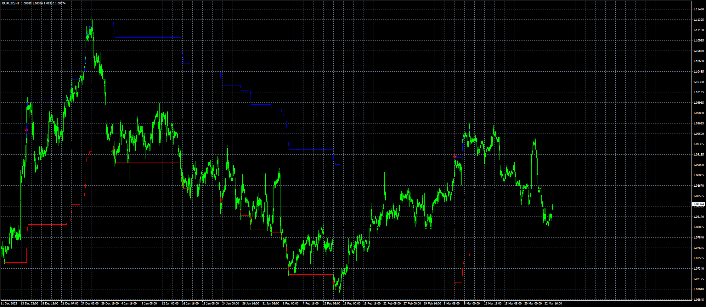

# Range_Filter

> Source: https://fxcodebase.com/code/viewtopic.php?f=38&t=73338  
> Forum: 38 · Topic 73338 · 4 post(s)

---

## Range_Filter

**Apprentice** · Sun Feb 05, 2023 3:42 am

 

Based on TS2 version.
[https://fxcodebase.com/code/viewtopic.php?f=17&p=149345](https://fxcodebase.com/code/viewtopic.php?f=17&p=149345)

 [Range_Filter.mq4](files/149500/Range_Filter.mq4)

---

## Re: Range_Filter

**4xmaster** · Tue Apr 16, 2024 1:59 pm

can you please make upper and lower lines move with the price and not waiting for candles

and put low and high arrows (one arrow per direction) when price touches the lines

---

## Re: Range_Filter

**Apprentice** · Mon Apr 22, 2024 11:20 am

We have added your request to the development list.
Development reference 323

---

## Re: Range_Filter

**Apprentice** · Tue May 07, 2024 2:57 am

 [Range_Filter+arrow.mq4](files/155253/Range_Filterarrow.mq4)
