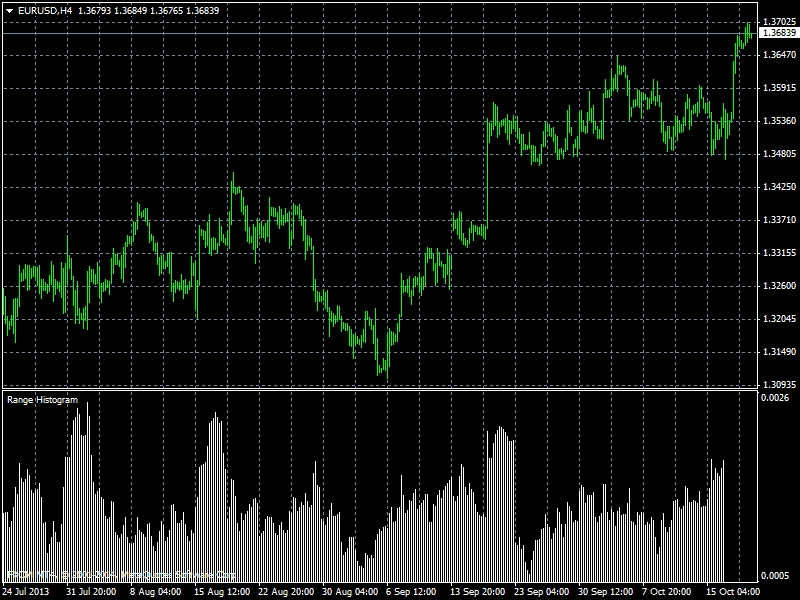

# Range Histogram

> Source: https://fxcodebase.com/code/viewtopic.php?f=38&t=60943  
> Forum: 38 · Topic 60943 · 1 post(s)

---

## Range Histogram

**Apprentice** · Mon Jul 21, 2014 6:30 am

Range can be defined as one of two
0. As the difference between High and Low price of period
1. As the difference between Open and Close price of the period
Additionally this raw data can be smoothed.

 [Range Histogram.mq4](files/95022/Range%20Histogram.mq4)
