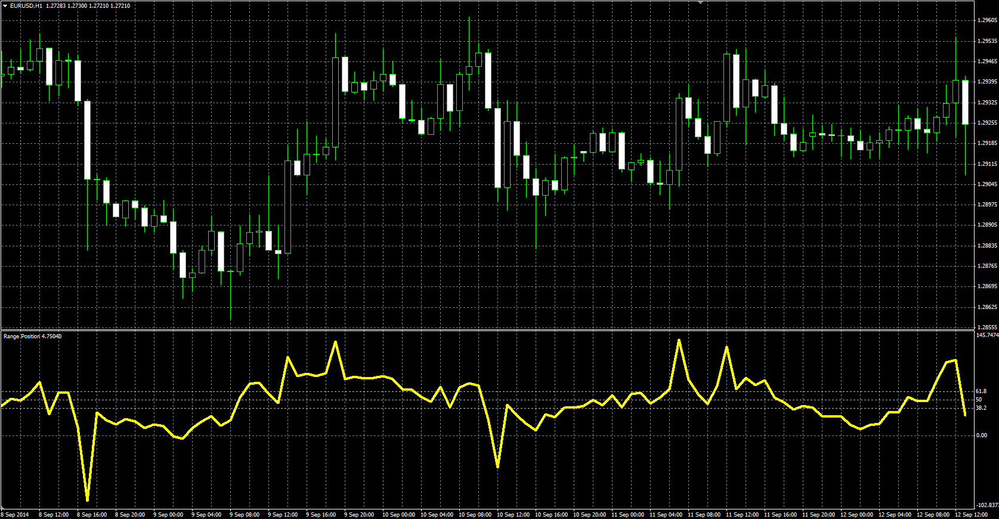

# Range Position oscillator

> Source: https://fxcodebase.com/code/viewtopic.php?f=38&t=61388  
> Forum: 38 · Topic 61388 · 1 post(s)

---

## Range Position oscillator

**Alexander.Gettinger** · Mon Oct 27, 2014 10:59 am

Original LUA oscillator: [viewtopic.php?f=17&t=23643](https://fxcodebase.com/code/viewtopic.php?f=17&t=23643).

Formula:
RP = 100*(Close-Min)/(Max-Min), where
Max, Min - maximum and minimum prices at range from (i-Length) to (i-1).

 

Download:

 [RP.mq4](files/96765/RP.mq4)
