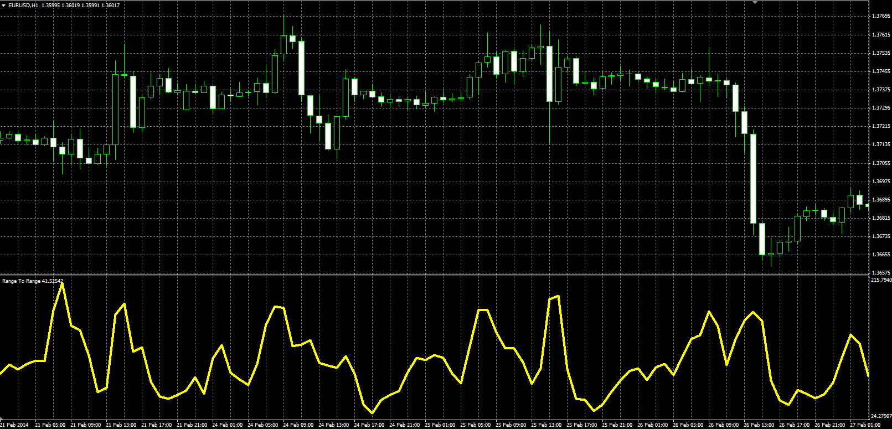

# Range To Range

> Source: https://fxcodebase.com/code/viewtopic.php?f=38&t=60774  
> Forum: 38 · Topic 60774 · 1 post(s)

---

## Range To Range

**Alexander.Gettinger** · Wed Jun 04, 2014 5:39 pm

Original LUA oscillator: [viewtopic.php?f=17&t=60244](https://fxcodebase.com/code/viewtopic.php?f=17&t=60244).

Formula:
RTR = 100*ATR(Fast_Length)/ATR(Slow_Length).

 

Download:

 [RTR.mq4](files/94316/RTR.mq4)
