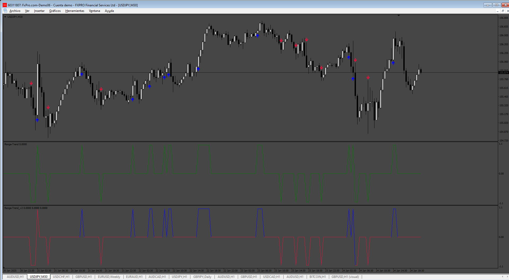
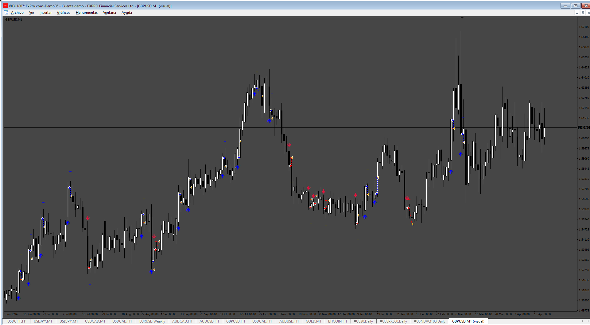
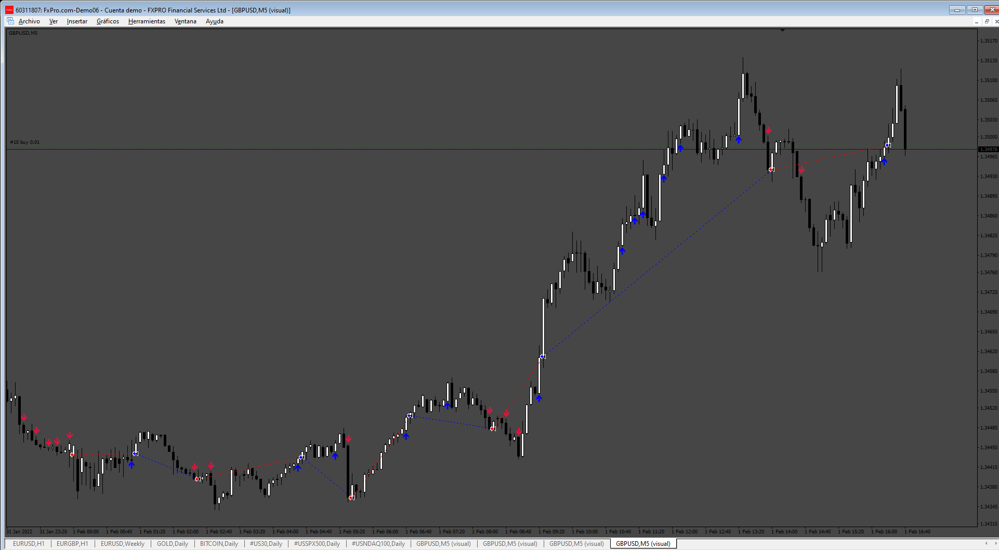

# Range-Trend

> Source: https://fxcodebase.com/code/viewtopic.php?f=38&t=75557  
> Forum: 38 · Topic 75557 · 5 post(s)

---

## Range-Trend

**Apprentice** · Mon Jan 27, 2025 2:52 pm

Based on the request.
[https://fxcodebase.com/code/viewtopic.php?f=38&t=75529](https://fxcodebase.com/code/viewtopic.php?f=38&t=75529)

 [Range-Trend_v2.mq4](files/158035/Range-Trend_v2.mq4)

---

## Re: Range-Trend

**Apprentice** · Wed Feb 19, 2025 7:18 am

 [Range-Trend_v2.mq4](files/158324/Range-Trend_v2.mq4)

 [Range_Trend_EA.mq4](files/158324/Range_Trend_EA.mq4)

---

## Re: Range-Trend

**beyourself** · Tue Mar 04, 2025 5:42 am

Thank you so much... but can you please add to the expert the option : close on the opposit signal? without using tp or sl. thank you...

---

## Re: Range-Trend

**Apprentice** · Mon Mar 10, 2025 2:58 pm

We have added your request to the development list.
Development reference 186

---

## Re: Range-Trend

**Apprentice** · Sun Mar 16, 2025 1:47 pm

 [Range_Trend_EA.mq4](files/158636/Range_Trend_EA.mq4)
