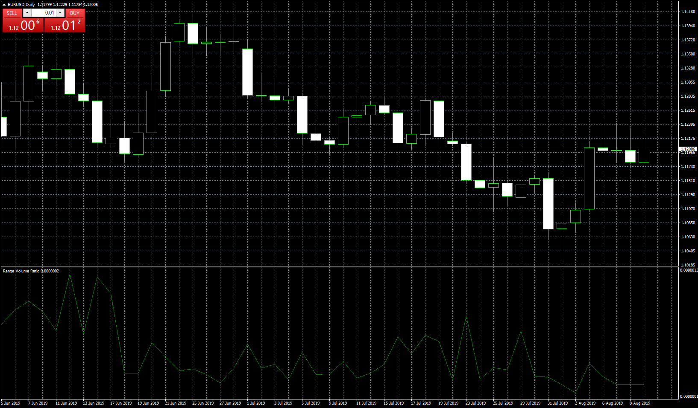

# Range Volume Ratio

> Source: https://fxcodebase.com/code/viewtopic.php?f=38&t=68771  
> Forum: 38 · Topic 68771 · 2 post(s)

---

## Range Volume Ratio

**Apprentice** · Sun Aug 11, 2019 9:23 am

A simplified version of TS2 / Lua Bill Williams' Market Facilitation Index
[viewtopic.php?f=17&t=1968](https://fxcodebase.com/code/viewtopic.php?f=17&t=1968)
Range Volume Ratio = (High-Low)/Volume

 [Range Volume Ratio.mq4](files/127836/Range%20Volume%20Ratio.mq4)

---

## Re: Range Volume Ratio

**logicgate** · Sun Aug 11, 2019 5:02 pm

Thanks buddy!
