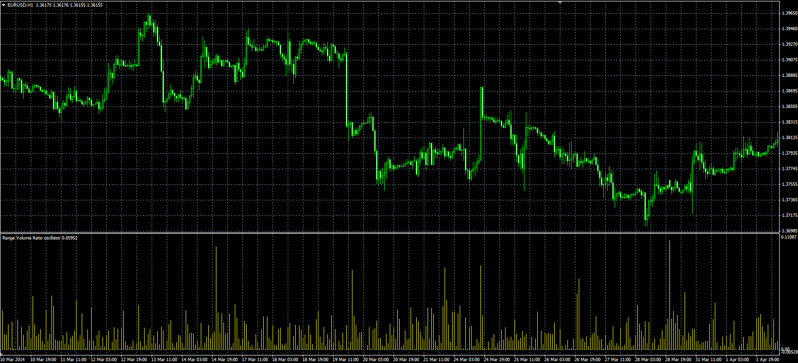
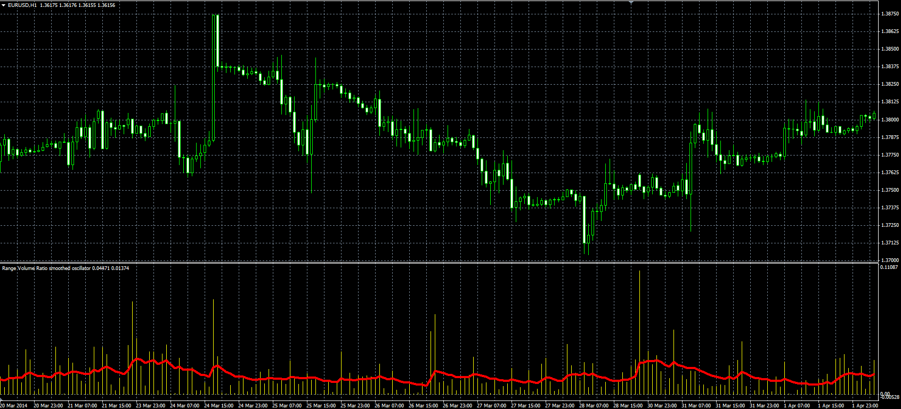
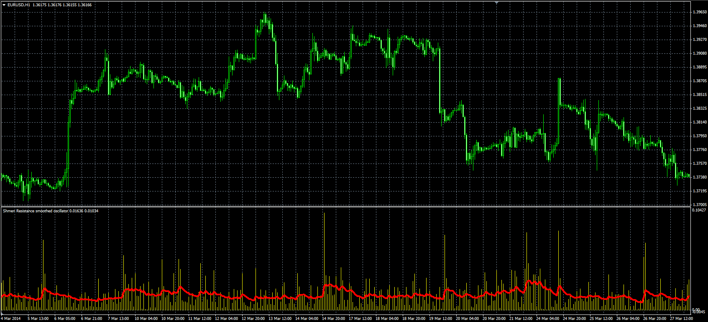

# Range Volume Ratio

> Source: https://fxcodebase.com/code/viewtopic.php?f=38&t=60790  
> Forum: 38 · Topic 60790 · 3 post(s)

---

## Range Volume Ratio

**Alexander.Gettinger** · Thu Jun 05, 2014 4:38 pm

Original LUA indicators: [viewtopic.php?f=17&t=60274](https://fxcodebase.com/code/viewtopic.php?f=17&t=60274).

**Range Volume Ratio**

Formula:
RVR[i] = Abs(Open[i]-Close[i])/Volume[i], if Method=0,
RVR[i] = (High[i]-Low[i])/Volume[i], if Method=1.

 

Download:

 [Range_Volume_Ratio.mq4](files/94356/Range_Volume_Ratio.mq4)

**Smoothed Range Volume Ratio**

Formulas:
RVR[i] = Abs(Open[i]-Close[i])/Volume[i], if Method=0,
RVR[i] = (High[i]-Low[i])/Volume[i], if Method=1,
Signal = Moving average(RVR, MA_Length, MA_Method).

 

Download:

 [Range_Volume_Ratio_S.mq4](files/94356/Range_Volume_Ratio_S.mq4)

**Smoothed Shmen Resistance**

Formulas:
SR = Diff/Vol, if not inverse,
SR = Vol/Diff, if inverse,
Vol = Max(Volume, MinVolume),
Diff = Max(RVR, MinPips),
RVR - Range Volume Ratio,
Signal = Moving average(SR, MA_Length, MA_Method).

 

Download:

 [Shmen_Resistance_S.mq4](files/94356/Shmen_Resistance_S.mq4)

---

## Re: Range Volume Ratio

**jay1994** · Mon Aug 11, 2014 11:44 pm

Hi, all.

Is there any way that someone could modify the Range_Volume_Ratio_S and the Shmen_Resistance_S?

To show if the previous bar was above or below the red line.

Maybe add something like- "Previous bar above line: True/False" in the indicator window.

Great indicator as always Apprentice

Look forward to hearing from you

---

## Re: Range Volume Ratio

**Apprentice** · Wed Aug 13, 2014 6:56 am

PreviousBarPosition parameter added.
F.Y.I. Alex was the author of the initial indictor.
I can not take the credit.
