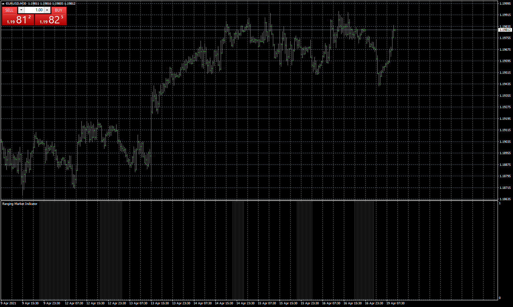

# Ranging_Market_Indicator

> Source: https://fxcodebase.com/code/viewtopic.php?f=38&t=71105  
> Forum: 38 · Topic 71105 · 3 post(s)

---

## Ranging_Market_Indicator

**Apprentice** · Mon Apr 19, 2021 2:32 am

Based on the TS2 version.
[https://fxcodebase.com/code/viewtopic.p ... 31#p141531](https://fxcodebase.com/code/viewtopic.php?f=17&p=141531#p141531)

 [Ranging_Market_Indicator.mq4](files/141578/Ranging_Market_Indicator.mq4)

---

## Re: Ranging_Market_Indicator

**myer16** · Mon Apr 19, 2021 3:45 am

Hello Apprentice
I have a query, This indicator will give us a signal of ranging maket, when conditions of all the 3 parameters (ADX, ATR and RSI as specified on the page [https://www.quantnews.com/3-ways-to-ide ... your-algo/](https://www.quantnews.com/3-ways-to-identify-a-ranging-market-with-your-algo/)) are met.?
Or when any one of the 3 parameter meet the condition?

---

## Re: Ranging_Market_Indicator

**Apprentice** · Wed Apr 21, 2021 11:53 am

[Ranging_Market_Indicator.mq4](files/141647/Ranging_Market_Indicator.mq4)

When at least 1 of them pass.
