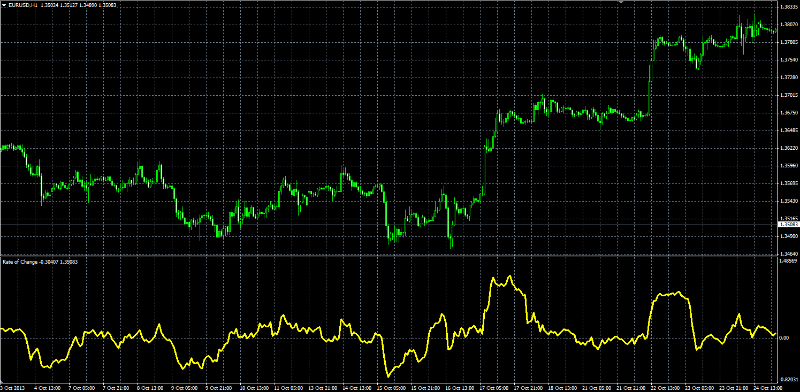

# Rate of Change oscillator

> Source: https://fxcodebase.com/code/viewtopic.php?f=38&t=59967  
> Forum: 38 · Topic 59967 · 6 post(s)

---

## Rate of Change oscillator

**Alexander.Gettinger** · Mon Nov 25, 2013 2:45 pm

Formula:
ROC[i] = (Price[i]/Price[i-Length]-1)*100.

 

Download:

 [ROC.mq4](files/91101/ROC.mq4)

 [2 symbol ROC.mq4](files/91101/2%20symbol%20ROC.mq4)

---

## Re: Rate of Change oscillator

**alienfriend18** · Thu Oct 08, 2020 11:29 am

Need modified ROC for two symbol

Suppose,
if price of symbol-A >(greater) than Symbol-B

then
Normal ROC line be of Symbol -A and Symbol B will have inverted ROC

when
price of Symbol-B greater than A,
then Symbol B ROC become normal ROC of symbol-A become the inverted one

CROSSOVER WILL HAPPEN

---

## Re: Rate of Change oscillator

**Apprentice** · Fri Oct 09, 2020 5:55 am

The prices for the two symbols are NOT comparable.
AUD/JPY will always be greater than AUD/USD...
Can you redefine your request?

---

## Re: Rate of Change oscillator

**alienfriend18** · Fri Oct 09, 2020 6:20 am

I will be using other symbols.I think it will work for me. Thanks

---

## Re: Rate of Change oscillator

**Apprentice** · Sun Oct 11, 2020 4:21 am

Your request is added to the development list.
Development reference 2168.

---

## Re: Rate of Change oscillator

**Apprentice** · Mon Oct 12, 2020 2:29 am

2 symbol ROC.mq4 added.
